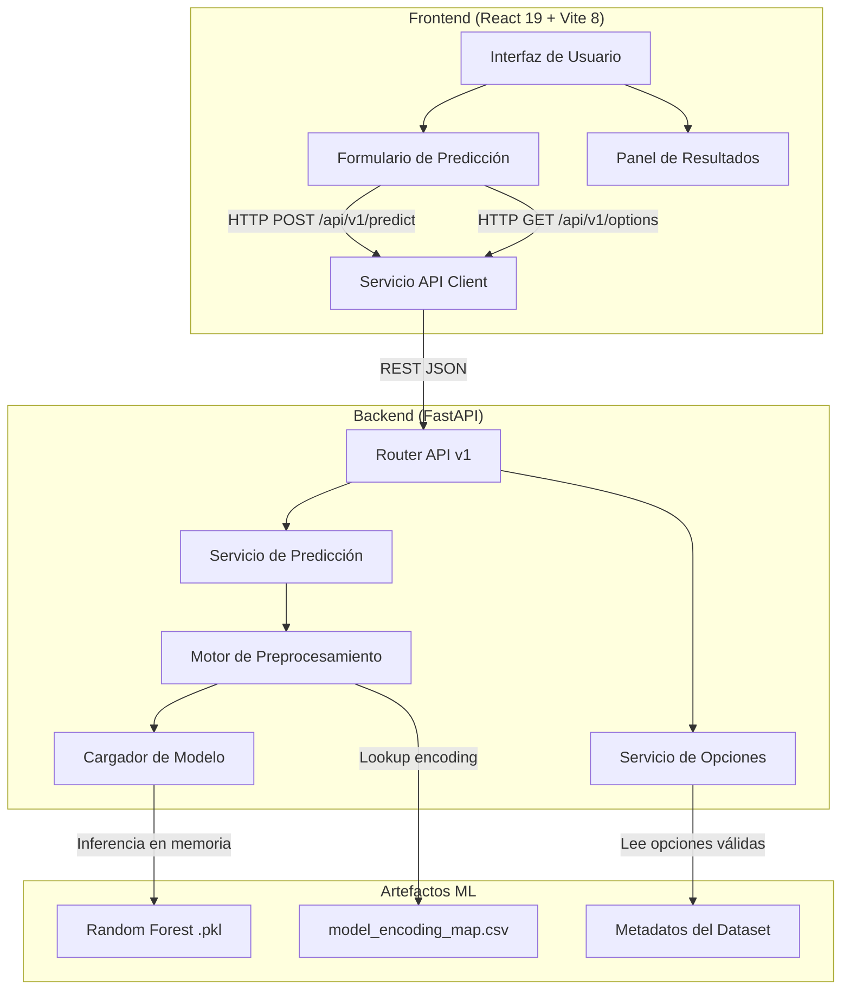
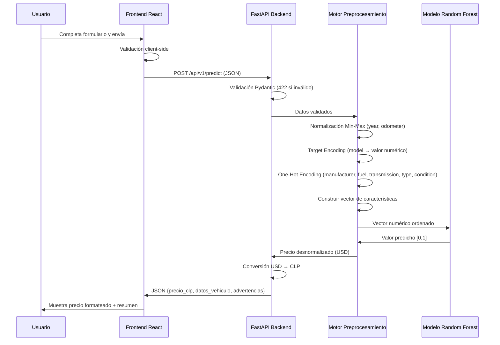
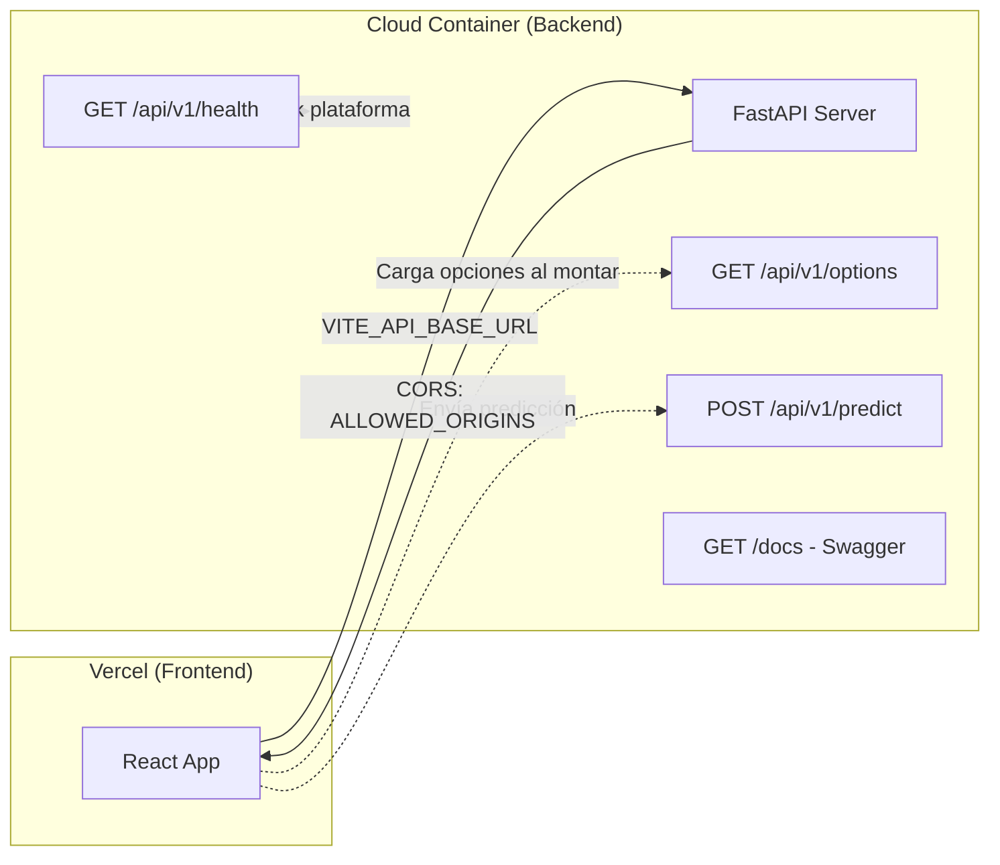
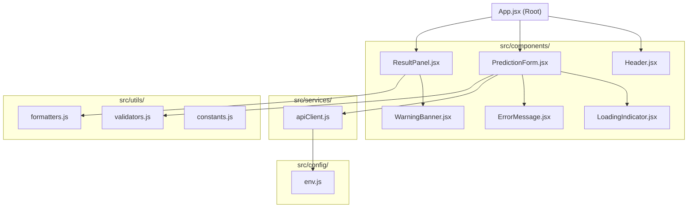

# Design Document

## Overview

Este documento describe el diseño técnico del sistema web de predicción de precios de vehículos usados. El sistema transforma el mockup existente (React/Vite) en una aplicación funcional conectada a un backend FastAPI que consume un modelo Random Forest entrenado previamente.

La arquitectura sigue un patrón cliente-servidor desacoplado: el frontend React se comunica vía HTTP REST con el backend FastAPI, el cual carga el modelo ML en memoria al iniciar y expone endpoints para predicción y opciones del formulario. El pipeline de preprocesamiento en inferencia replica las transformaciones del entrenamiento (normalización Min-Max, Target Encoding, One-Hot Encoding).

**Decisiones clave de diseño:**
- Separación completa frontend/backend para despliegue independiente (Vercel + contenedor cloud)
- Modelo cargado en memoria al inicio del servidor para latencia mínima en predicción
- Encoding map y metadatos del dataset cargados como artefactos estáticos del backend
- Variables de entorno para configuración de URLs y CORS sin hardcodeo

## Architecture

### Diagrama de Arquitectura General



### Diagrama de Flujo de Predicción



### Diagrama de Comunicación Frontend-Backend



### Diagrama de Estructura Modular del Frontend



## Components and Interfaces

### Frontend - Componentes React

| Componente | Responsabilidad | Props principales |
|---|---|---|
| `App.jsx` | Orquestador principal, manejo de estado global | — |
| `Header.jsx` | Logo, título y descripción del sistema | — |
| `PredictionForm.jsx` | Formulario con campos, validación y envío | `onSubmit`, `options`, `loading`, `optionsError` |
| `ResultPanel.jsx` | Muestra precio estimado y resumen del vehículo | `result`, `loading`, `error` |
| `LoadingIndicator.jsx` | Spinner animado con mensajes rotativos | `messages`, `interval` |
| `ErrorMessage.jsx` | Mensajes de error con categorización | `error`, `onRetry` |
| `WarningBanner.jsx` | Advertencias del modelo (marca/modelo no reconocido) | `warnings` |

### Frontend - Servicios

```javascript
// src/services/apiClient.js
export const apiClient = {
  getOptions(): Promise<OptionsResponse>,
  predict(data: PredictionRequest): Promise<PredictionResponse>,
  healthCheck(): Promise<boolean>
}
```

### Frontend - Utilidades

```javascript
// src/utils/formatters.js
export function formatPriceCLP(priceNumber): string  // → "$12.500.000"
export function formatKilometers(km): string          // → "120.000 km"

// src/utils/validators.js
export function validateForm(formData): ValidationErrors | null
export function isValidYear(year): boolean
export function isValidOdometer(km): boolean

// src/config/env.js
export const API_BASE_URL = import.meta.env.VITE_API_BASE_URL
```

### Backend - Módulos FastAPI

| Módulo | Ubicación | Responsabilidad |
|---|---|---|
| `main.py` | `backend/` | Punto de entrada, configuración CORS, carga de modelo |
| `routes/predict.py` | `backend/routes/` | Endpoint POST /api/v1/predict |
| `routes/options.py` | `backend/routes/` | Endpoint GET /api/v1/options |
| `routes/health.py` | `backend/routes/` | Endpoint GET /api/v1/health |
| `services/prediction.py` | `backend/services/` | Lógica de predicción y desnormalización |
| `services/preprocessor.py` | `backend/services/` | Pipeline de preprocesamiento (normalización, encoding, one-hot) |
| `services/options_loader.py` | `backend/services/` | Carga y exposición de opciones válidas del dataset |
| `models/schemas.py` | `backend/models/` | Modelos Pydantic para request/response |
| `utils/model_loader.py` | `backend/utils/` | Carga del modelo .pkl y encoding map |
| `utils/constants.py` | `backend/utils/` | Constantes de normalización y configuración |

### Backend - Interfaces de API

```python
# POST /api/v1/predict
# Request Body
class PredictionRequest(BaseModel):
    manufacturer: str
    model: str
    year: int = Field(ge=1980, le=2024)
    odometer: int = Field(ge=0, le=300000)
    fuel: str
    transmission: str
    type: str

# Response Body
class PredictionResponse(BaseModel):
    precio_clp: int
    precio_usd: float
    vehiculo: VehicleData
    advertencias: list[str] = []

class VehicleData(BaseModel):
    manufacturer: str
    model: str
    year: int
    odometer: int
    fuel: str
    transmission: str
    type: str

# GET /api/v1/options
class OptionsResponse(BaseModel):
    manufacturers: list[str]
    models_by_manufacturer: dict[str, list[str]]
    fuels: list[str]
    transmissions: list[str]
    types: list[str]

# GET /api/v1/health
class HealthResponse(BaseModel):
    status: str  # "healthy" | "unhealthy"
    model_loaded: bool
    version: str

# Error Response (422)
class ValidationErrorResponse(BaseModel):
    detail: list[FieldError]

class FieldError(BaseModel):
    field: str
    message: str
```

## Data Models

### Estructura del Vector de Características

El modelo Random Forest fue entrenado con un dataset procesado de 76 columnas. Para la inferencia, el backend debe construir un vector numérico con las siguientes características en orden:

| Índice | Feature | Tipo | Transformación |
|---|---|---|---|
| 0 | year | float [0,1] | Min-Max: (valor - 1981) / (2024 - 1981) |
| 1 | model | float [0,1] | Target Encoding via encoding_map.csv |
| 2 | odometer | float [0,1] | Min-Max: (valor - 1) / (299999 - 1) |
| 3-4 | lat, long | float | Valores por defecto (promedio dataset) |
| 5-34 | manufacturer_* | bool (0/1) | One-Hot con drop_first (30 categorías) |
| 35-38 | fuel_* | bool (0/1) | One-Hot con drop_first (4 categorías) |
| 39-40 | transmission_* | bool (0/1) | One-Hot con drop_first (2 categorías) |
| 41-54 | type_* | bool (0/1) | One-Hot con drop_first (14 categorías) |
| 55-60 | condition_* | bool (0/1) | One-Hot con drop_first (6 categorías) |

**Nota:** Las columnas `cylinders`, `title_status`, `drive`, `paint_color`, `state` presentes en el CSV procesado no se incluyen como features numéricas directas del modelo. El vector final excluye la columna `price` (target) y las columnas de texto no transformadas. El orden exacto se determina por las columnas del DataFrame de entrenamiento.

### Parámetros de Normalización

```python
# Constantes del pipeline de entrenamiento
YEAR_MIN = 1981
YEAR_MAX = 2024
ODOMETER_MIN = 1
ODOMETER_MAX = 299999
PRICE_MIN = 1000   # USD
PRICE_MAX = 100000 # USD

# Desnormalización del precio predicho
# precio_usd = predicted_value * (PRICE_MAX - PRICE_MIN) + PRICE_MIN
# precio_clp = precio_usd * tasa_cambio (configurable, default ~950)
```

### Encoding Map (Target Encoding)

El archivo `model_encoding_map.csv` contiene ~20,000+ entradas con formato:
```
model,price
sierra 1500 crew cab slt,0.329174916...
silverado 1500,0.218059315...
```

Donde `price` es el valor normalizado [0,1] del precio promedio por modelo, usado como feature numérica para la columna `model`.

**Manejo de modelos desconocidos:** Si el modelo ingresado no existe en el encoding map, se usa el promedio global de todos los valores del encoding map.

### Estructura de Carpetas Propuesta

```
app-mockup-autos-celso/
├── public/
│   ├── favicon.svg
│   └── icons.svg
├── src/
│   ├── components/
│   │   ├── Header.jsx
│   │   ├── PredictionForm.jsx
│   │   ├── ResultPanel.jsx
│   │   ├── LoadingIndicator.jsx
│   │   ├── ErrorMessage.jsx
│   │   └── WarningBanner.jsx
│   ├── services/
│   │   └── apiClient.js
│   ├── utils/
│   │   ├── formatters.js
│   │   ├── validators.js
│   │   └── constants.js
│   ├── config/
│   │   └── env.js
│   ├── App.jsx
│   ├── index.css
│   └── main.jsx
├── backend/
│   ├── main.py
│   ├── routes/
│   │   ├── __init__.py
│   │   ├── predict.py
│   │   ├── options.py
│   │   └── health.py
│   ├── services/
│   │   ├── __init__.py
│   │   ├── prediction.py
│   │   ├── preprocessor.py
│   │   └── options_loader.py
│   ├── models/
│   │   ├── __init__.py
│   │   └── schemas.py
│   ├── utils/
│   │   ├── __init__.py
│   │   ├── model_loader.py
│   │   └── constants.py
│   ├── artifacts/
│   │   └── model_encoding_map.csv
│   ├── requirements.txt
│   └── Dockerfile
├── docs/
│   ├── arquitectura.md
│   ├── flujo-prediccion.md
│   ├── estructura-proyecto.md
│   └── estrategia-despliegue.md
├── .env.example
├── index.html
├── package.json
├── vite.config.js
└── README.md
```


## Correctness Properties

*Una propiedad es una característica o comportamiento que debe mantenerse verdadero en todas las ejecuciones válidas de un sistema — esencialmente, una declaración formal sobre lo que el sistema debe hacer. Las propiedades sirven como puente entre especificaciones legibles por humanos y garantías de corrección verificables por máquina.*

### Property 1: Filtrado de modelos por marca

*For any* marca seleccionada del conjunto de opciones válidas, los modelos disponibles mostrados en el formulario deben ser exclusivamente aquellos que pertenecen a esa marca según los datos del dataset de entrenamiento, sin incluir modelos de otras marcas.

**Validates: Requirements 2.3**

### Property 2: Validación de formulario rechaza entradas inválidas

*For any* estado del formulario donde al menos un campo obligatorio está vacío o contiene un valor fuera de los rangos permitidos, la función de validación debe retornar un objeto de errores que contenga al menos una entrada, y el formulario no debe enviarse al backend.

**Validates: Requirements 2.4**

### Property 3: Validación de rangos numéricos

*For any* valor entero, la validación de año debe aceptarlo si y solo si está en el rango [1980, añoActual], y la validación de kilometraje debe aceptarlo si y solo si está en el rango [0, 300000].

**Validates: Requirements 2.5, 2.6**

### Property 4: Preprocesamiento produce vector de características válido

*For any* entrada de vehículo válida (marca conocida, modelo conocido, año en rango, kilometraje en rango, combustible válido, transmisión válida, tipo válido), el motor de preprocesamiento debe producir un vector numérico donde: el valor de año está normalizado en [0,1] según Min-Max con parámetros (1981, 2024), el valor de kilometraje está normalizado en [0,1] según Min-Max con parámetros (1, 299999), exactamente una columna one-hot de manufacturer es 1 y el resto son 0, exactamente una columna one-hot de fuel es 1 y el resto son 0, y el vector tiene la longitud exacta esperada por el modelo.

**Validates: Requirements 3.1, 3.2**

### Property 5: Round-trip de normalización de precio

*For any* valor de precio en USD dentro del rango [1000, 100000], normalizar el precio con Min-Max (min=1000, max=100000) y luego desnormalizar el resultado debe producir el valor original (dentro de tolerancia de punto flotante). Equivalentemente, para cualquier valor predicho en [0,1], la desnormalización debe producir un valor en [1000, 100000] USD.

**Validates: Requirements 3.3**

### Property 6: Modelo desconocido usa encoding promedio

*For any* string que no existe como clave en el encoding map, el valor de encoding asignado debe ser igual al promedio aritmético de todos los valores del encoding map.

**Validates: Requirements 3.5**

### Property 7: Marca desconocida produce vector one-hot de ceros

*For any* string que no corresponde a una marca conocida del dataset de entrenamiento, todas las columnas one-hot de manufacturer en el vector de características deben tener valor 0.

**Validates: Requirements 3.6**

### Property 8: Formateo de precio en CLP

*For any* número entero positivo representando un precio en CLP, la función de formateo debe producir un string que comience con "$", use punto como separador de miles, no contenga decimales, y al parsear el string de vuelta (removiendo "$" y puntos) se obtenga el número original.

**Validates: Requirements 4.1**

### Property 9: Validación backend retorna errores estructurados

*For any* request JSON al endpoint POST /api/v1/predict que contenga al menos un campo con valor inválido (año fuera de rango, kilometraje negativo, campo faltante), el backend debe retornar HTTP 422 con un cuerpo que contenga un arreglo de errores donde cada error incluye el nombre del campo inválido y un mensaje descriptivo.

**Validates: Requirements 5.3**

## Error Handling

### Frontend - Estrategia de Manejo de Errores

| Escenario | Comportamiento | UX |
|---|---|---|
| Timeout al cargar opciones (>10s) | Muestra error + botón reintentar | Mensaje: "No se pudieron cargar las opciones. Intenta nuevamente." |
| Error de red en predicción | Categoriza como "conexión" | Mensaje: "No se pudo conectar con el servicio de predicción." |
| Error 422 del backend | Muestra errores por campo | Mensajes inline junto a cada campo inválido |
| Error 500 del backend | Categoriza como "servidor" | Mensaje: "Error interno del servidor. Intenta más tarde." |
| Respuesta con advertencias | Muestra advertencias junto al precio | Banner amarillo con cada advertencia |
| Backend no disponible (health check falla) | Deshabilita formulario | Mensaje: "Servicio temporalmente no disponible." |

**Principio:** Nunca exponer códigos internos, trazas de pila ni nombres de módulos del backend al usuario.

### Backend - Estrategia de Manejo de Errores

| Escenario | Código HTTP | Respuesta |
|---|---|---|
| Datos de entrada inválidos (Pydantic) | 422 | `{"detail": [{"field": "year", "message": "Debe estar entre 1980 y 2024"}]}` |
| Modelo ML produce error en inferencia | 500 | `{"detail": "La predicción no pudo completarse"}` |
| Modelo ML retorna valor fuera de [0,1] | 500 | `{"detail": "La predicción no pudo completarse"}` |
| Modelo no reconocido en encoding map | 200 | Respuesta normal + `advertencias: ["El modelo no fue reconocido..."]` |
| Marca no reconocida | 200 | Respuesta normal + `advertencias: ["La marca no fue reconocida..."]` |
| Error al cargar modelo al inicio | Servidor no inicia | Log de error, health endpoint retorna unhealthy |

### Timeouts y Reintentos

- **Frontend → Backend:** Timeout de 10 segundos por request
- **Carga de opciones:** Timeout de 10 segundos, con mecanismo de reintento manual
- **Backend - inferencia:** El modelo en memoria no tiene timeout explícito (operación síncrona < 1s)
- **Health check:** Usado por la plataforma cloud para verificar disponibilidad

## Testing Strategy

### Enfoque Dual de Testing

El proyecto utiliza una estrategia combinada de tests unitarios (ejemplos específicos) y tests basados en propiedades (verificación universal):

#### Tests Basados en Propiedades (Property-Based Testing)

**Librería:** [fast-check](https://github.com/dubzzz/fast-check) para frontend (JavaScript), [Hypothesis](https://hypothesis.readthedocs.io/) para backend (Python)

**Configuración:**
- Mínimo 100 iteraciones por propiedad
- Cada test referencia su propiedad del documento de diseño
- Tag format: `Feature: vehicle-price-prediction-webapp, Property {N}: {título}`

**Propiedades a implementar:**

| # | Propiedad | Capa | Librería |
|---|---|---|---|
| 1 | Filtrado de modelos por marca | Frontend | fast-check |
| 2 | Validación de formulario rechaza inválidos | Frontend | fast-check |
| 3 | Validación de rangos numéricos | Frontend | fast-check |
| 4 | Preprocesamiento produce vector válido | Backend | Hypothesis |
| 5 | Round-trip normalización de precio | Backend | Hypothesis |
| 6 | Modelo desconocido usa encoding promedio | Backend | Hypothesis |
| 7 | Marca desconocida produce one-hot de ceros | Backend | Hypothesis |
| 8 | Formateo de precio en CLP | Frontend | fast-check |
| 9 | Validación backend retorna errores estructurados | Backend | Hypothesis |

#### Tests Unitarios (Example-Based)

**Frontend (Vitest + React Testing Library):**
- Renderizado correcto de componentes
- Flujo completo de formulario → resultado
- Estados de carga y error
- Accesibilidad (estados focus, disabled)
- Responsive breakpoints

**Backend (pytest):**
- Endpoints responden con estructura correcta
- Health check retorna estado del modelo
- CORS headers presentes
- Manejo de errores específicos (modelo no cargado, encoding map corrupto)

#### Tests de Integración

- Frontend ↔ Backend: flujo completo de predicción end-to-end
- Carga de opciones desde el backend real
- Verificación de tiempos de respuesta (<5s predicción, <2s opciones)

### Estructura de Tests

```
app-mockup-autos-celso/
├── src/
│   └── __tests__/
│       ├── components/
│       │   ├── PredictionForm.test.jsx
│       │   └── ResultPanel.test.jsx
│       ├── utils/
│       │   ├── formatters.test.js
│       │   ├── validators.test.js
│       │   └── validators.property.test.js   ← Properties 2, 3, 8
│       └── services/
│           └── apiClient.test.js
├── backend/
│   └── tests/
│       ├── test_predict.py
│       ├── test_options.py
│       ├── test_health.py
│       ├── test_preprocessor.py
│       ├── test_preprocessor_properties.py   ← Properties 4, 5, 6, 7
│       └── test_validation_properties.py     ← Property 9
```
