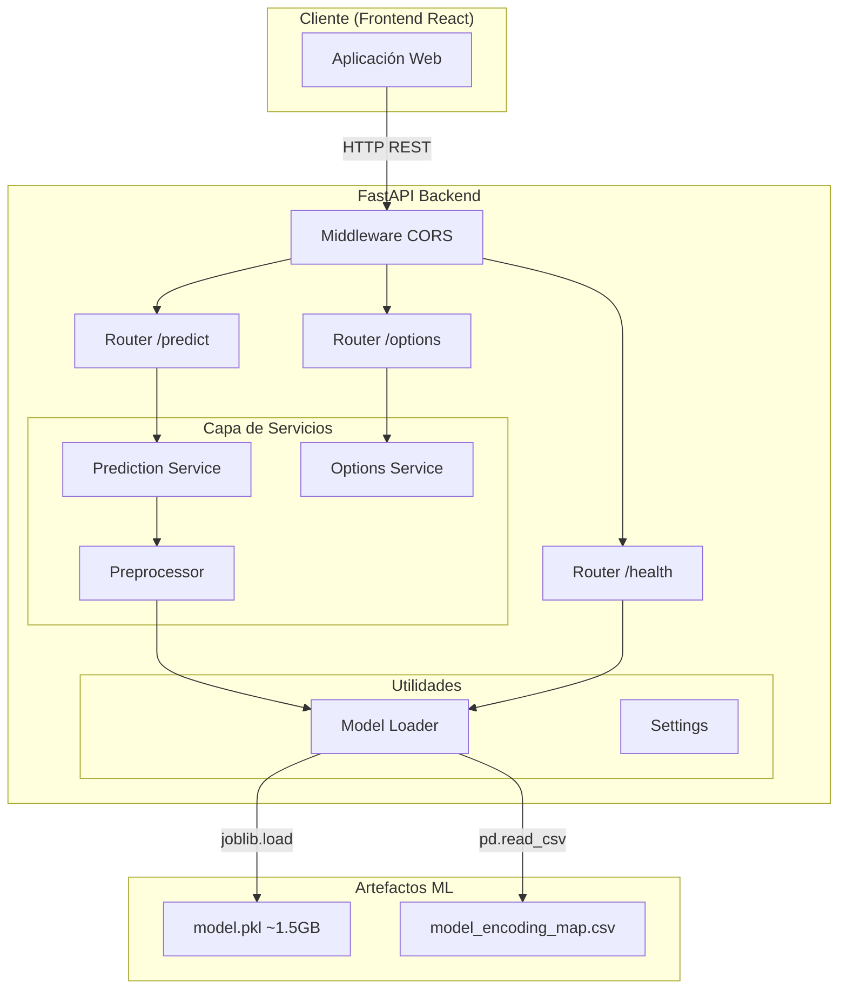
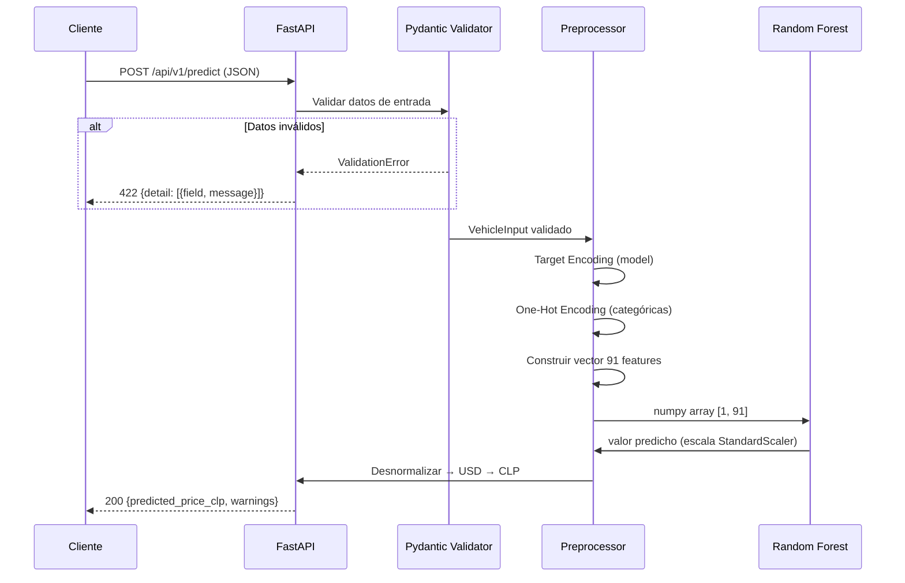

# Arquitectura del Backend

## Descripción General

El backend es una API REST construida con FastAPI que expone un modelo de Machine Learning (Random Forest) para predicción de precios de vehículos usados. Sigue una arquitectura modular con separación clara de responsabilidades.

## Diagrama de Arquitectura

## Flujo de una Predicción

## Decisiones de Diseño

### 1. Carga del modelo al startup (Lazy Loading)
- **Problema:** El modelo pesa ~1.5 GB
- **Solución:** Se carga una sola vez al iniciar el servidor usando el evento `lifespan`
- **Beneficio:** Cada request toma <1s en lugar de 10-30s

### 2. StandardScaler sin parámetros guardados
- **Problema:** El scaler no fue serializado junto al modelo
- **Solución:** Random Forest es invariante a escala (usa umbrales, no distancias). Se aproximan los parámetros con estadísticas conocidas del dataset.
- **Riesgo:** Predicciones pueden tener offset. Se mitiga con validación de rangos.

### 3. Separación de responsabilidades
- **Routers:** Solo manejan HTTP (request/response)
- **Services:** Lógica de negocio (predicción, preprocesamiento)
- **Utils:** Infraestructura (carga de archivos, configuración)
- **Schemas:** Contratos de datos (Pydantic)

### 4. Manejo de valores desconocidos
- **Modelo no reconocido:** Se usa el promedio global del encoding map + advertencia
- **Marca no reconocida:** Todas las columnas one-hot en 0 + advertencia
- **El usuario siempre recibe una predicción** (aunque sea menos precisa)

## Consideraciones de Despliegue

| Aspecto | Requisito |
|---------|-----------|
| RAM mínima | 2 GB (modelo ~1.5 GB + overhead) |
| Tiempo de inicio | 10-30 segundos |
| Concurrencia | Limitada por GIL de Python (usar workers) |
| Escalabilidad | Horizontal con múltiples instancias |
| Health check | GET /api/v1/health para load balancers |

## Referencias

- [FastAPI Documentation](https://fastapi.tiangolo.com/)
- [scikit-learn RandomForestRegressor](https://scikit-learn.org/stable/modules/generated/sklearn.ensemble.RandomForestRegressor.html)
- Notebook de entrenamiento: `notebooks/02_preprocesamiento_Primer_avance_CD_autos.ipynb`
- Script de encoding: `src/encode_dataset.py`
