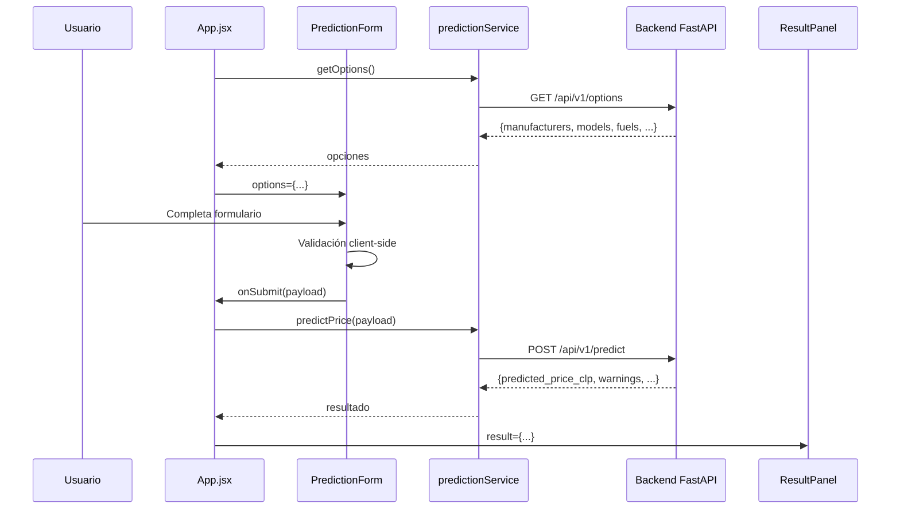

# Documentación Frontend — Integración con API

## Descripción General

El frontend es una aplicación React 19 + Vite que se conecta al backend FastAPI para obtener predicciones de precios de vehículos en tiempo real. Utiliza un diseño dark theme con branding verde (#1ED760) inspirado en aplicaciones modernas.

## Estructura del Frontend

```
src/
├── App.jsx                    # Orquestador principal (estado global)
├── main.jsx                   # Punto de entrada React
├── index.css                  # Estilos globales + variables CSS
├── components/
│   ├── PredictionForm.jsx     # Formulario con validación y opciones dinámicas
│   └── ResultPanel.jsx        # Panel de resultados con animaciones
└── services/
    └── predictionService.js   # Capa de comunicación con la API (Axios)
```

## Flujo de Datos



## Componentes Principales

### App.jsx
- Orquesta el estado global (opciones, loading, resultado, error)
- Carga opciones del backend al montar
- Delega la UI a componentes hijos

### PredictionForm.jsx
- Formulario con 8 campos (marca, modelo, año, km, combustible, transmisión, tipo, condición)
- Opciones cargadas dinámicamente desde el backend
- Soporte para "Otro" en marca y modelo (campo de texto libre)
- Validación client-side antes de enviar
- Warnings visuales para marcas/modelos no reconocidos

### ResultPanel.jsx
- Muestra precio estimado con animación de contador
- Precio en CLP y USD
- Badge de confianza (Alta/Media/Baja según warnings)
- Rango estimado (±10%)
- Detalles del vehículo consultado
- Botón "Nueva consulta"
- Estados: vacío, cargando, error, resultado

### predictionService.js
- Instancia Axios centralizada con timeout de 15s
- URL base desde variable de entorno `VITE_API_URL`
- Parseo de errores en mensajes legibles (nunca expone detalles técnicos)
- Funciones: `getOptions()`, `predictPrice()`, `checkHealth()`

## Variables de Entorno

| Variable | Descripción | Ejemplo |
|----------|-------------|---------|
| `VITE_API_URL` | URL base del backend | `http://localhost:8000` |

Archivos:
- `.env` — Desarrollo local
- `.env.production` — Producción (ajustar al desplegar)

## Integración con la API

### Payload enviado a POST /api/v1/predict

```json
{
  "manufacturer": "toyota",
  "model": "camry",
  "year": 2018,
  "odometer": 45000,
  "fuel": "gas",
  "transmission": "automatic",
  "type": "sedan",
  "condition": "good"
}
```

### Respuesta recibida

```json
{
  "predicted_price_usd": 15200.50,
  "predicted_price_clp": 14440475,
  "vehicle_data": {
    "manufacturer": "toyota",
    "model": "camry",
    "year": 2018,
    "odometer": 45000,
    "fuel": "gas",
    "transmission": "automatic",
    "type": "sedan",
    "condition": "good"
  },
  "warnings": []
}
```

## Instrucciones de Ejecución

```bash
# Desde la carpeta raíz del frontend (app-mockup-autos-celso/)
cd app-mockup-autos-celso

# Instalar dependencias
npm install

# Ejecutar en modo desarrollo
npm run dev

# El frontend estará en http://localhost:5173
# Asegúrate de que el backend esté corriendo en http://localhost:8000
```

## Manejo de Errores

| Escenario | Comportamiento |
|-----------|---------------|
| Backend apagado | "No se pudo conectar con el servidor" + botón reintentar |
| Timeout (>15s) | "La solicitud tardó demasiado" |
| Error 422 | Muestra errores por campo |
| Error 503 | "Servicio no disponible" |
| Error 500 | "Error interno del servidor" |
| Opciones no cargan | Mensaje de error + botón reintentar |

## Capturas Recomendadas para el Informe

1. Formulario vacío (estado inicial)
2. Formulario con datos ingresados
3. Estado de carga (spinner + mensajes)
4. Resultado exitoso con precio y detalles
5. Resultado con warnings (marca/modelo no reconocido)
6. Error de conexión (backend apagado)
7. Vista móvil del formulario
8. Vista móvil del resultado
9. Swagger del backend (/docs)

## Decisiones de Diseño

1. **Sin Tailwind CSS:** Se mantuvo el sistema de CSS puro con variables ya existente para consistencia con el branding original.
2. **Axios centralizado:** Toda la comunicación HTTP pasa por `predictionService.js` para facilitar cambios futuros.
3. **Variables de entorno:** `VITE_API_URL` permite cambiar el backend sin modificar código.
4. **Animación de precio:** Contador animado para dar sensación de cálculo real.
5. **Confianza y rango:** Calculados en frontend basándose en los warnings del backend.
