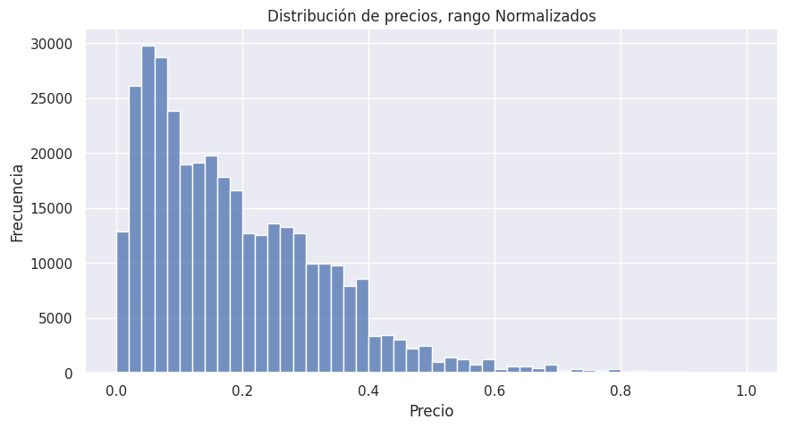
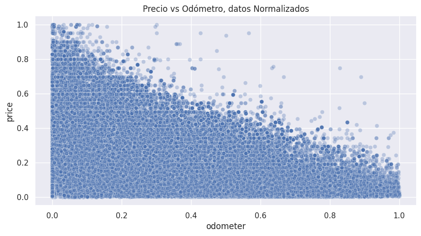
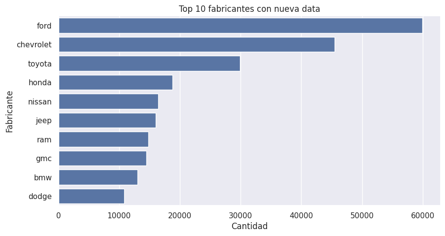
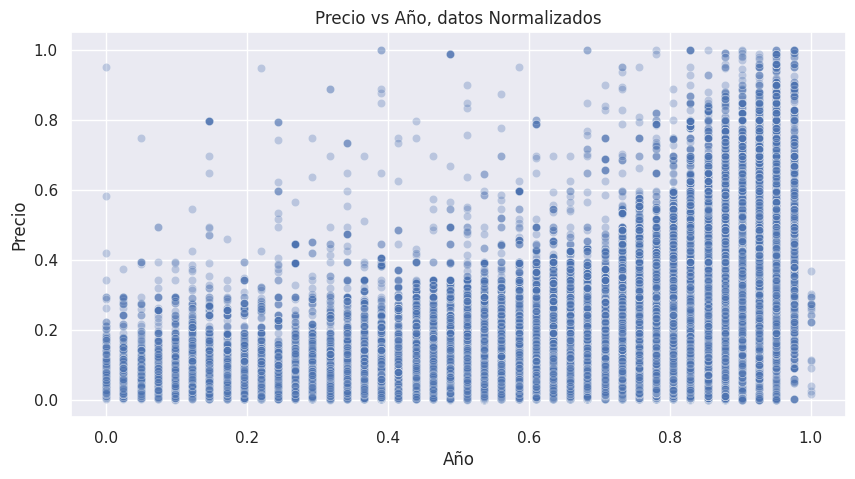

# Informe Técnico: Proyecto de Ciencia de Datos - Predicción de Precios de Vehículos Usados

## I. Introducción

En el dinámico y caótico mercado de vehículos usados, la correcta tasación de un automóvil representa un desafío crítico. Determinar un precio justo a menudo depende de criterios altamente subjetivos o herramientas precarias sumado a la gran cantidad de factores que influyen en este valor, resultando en ineficiencias que afectan tanto a empresas automotoras como a usuarios particulares en la compra y venta. 

Este proyecto aborda la problemática desde la perspectiva de la ciencia de datos, buscando domesticar el caos subyacente en el mercado automotriz a través del aprendizaje automático. El objetivo último es desentrañar cómo las diversas características estructurales y técnicas de un vehículo esculpen su valor monetario, proponiendo un modelo predictivo robusto, coherente y escalable. Aportando así un granito de arena en la industria; creando un sistema que pueda predecir, o más bien estimar, el valor de un automóvil con base en sus semejantes que antes vinieron.

## II. Problema, Objetivos y KPIs

### II.i Problema y pregunta
La determinación del precio de un vehículo usado carece de un estándar objetivo, originando inconsistencias, sobrevaloraciones o subvaloraciones en las transacciones del mercado. Surge así la pregunta analítica: **¿En qué medida es posible estimar el precio de un vehículo usado a partir de sus características estructurales y técnicas, tales como año, marca, modelo, kilometraje y tipo de combustible?**

### II.ii Objetivo General
Desarrollar un modelo de regresión capaz de estimar con una precisión subyacente el precio de vehículos usados a partir de sus características, empleando técnicas de procesamiento de datos y aprendizaje automático sobre un conjunto de datos de precios y características de vehículos.

### II.iii Objetivos Específicos
1. **Desarrollar un análisis exploratorio de datos (EDA) completo**  
   Analizar estadísticamente y visualizar el dataset para identificar distribuciones, correlaciones y patrones relevantes entre variables predictoras y la variable objetivo.  
   **Métrica de éxito:** Generación de al menos 8 visualizaciones relevantes y un informe con hallazgos clave documentados en notebooks y/o reportes.
   **Plazo:** 3 semanas.

2. **Realizar un proceso de limpieza y preprocesamiento del dataset**  
   Transformar el dataset original en una versión completamente utilizable para modelamiento, eliminando valores nulos, corrigiendo inconsistencias, eliminando variables irrelevantes y aplicando técnicas de codificación y normalización.  
   **Métrica de éxito:** 100% de las variables en formato numérico, 0 valores nulos y dataset final validado sin errores de entrenamiento.  
   **Plazo:** 4 semanas.  

3. **Construir y evaluar múltiples modelos de regresión**  
   Implementar, entrenar y comparar al menos 5 técnicas de regresión utilizando el mismo dataset procesado, evaluando su desempeño mediante métricas estandarizadas.  
   **Métrica de éxito:** Comparación completa en base a MAE, RMSE, R² y MAPE, y selección de un modelo con R² ≥ 0.90.  
   **Plazo:** 6 semanas.

4. **Diseñar un prototipo funcional de interfaz de usuario para tasación**  
   Desarrollar una interfaz básica que permita ingresar características de un vehículo y obtener una predicción de precio basada en el modelo seleccionado.  
   **Métrica de éxito:** Prototipo funcional capaz de recibir inputs del usuario y generar predicciones en menos de 2 segundos.  
   **Plazo:** 8 semanas.

### II.iv KPIs
- **Precisión de estimación:** Capacidad de entregar precios cercanos al valor real del mercado, medido a través de métricas como RMSE y R², por  ejemplo con valores cercanos a 0.40 y 0.90, respectivamente.
- **Consistencia de resultados:** Tasaciones similares frente a vehículos de características análogas.
- **Usabilidad de la solución:** Simplicidad en la captura de datos y claridad en la estimación.
- **Valor práctico para el negocio:** Viabilidad del sistema para ser adoptado por tasadores, plataformas o entidades como el SII.

## III. Antecedentes y Fuentes

El mercado automotriz ha operado históricamente basado en heurísticas y experiencia humana. Por su parte, la digitalización ha permitido el registro masivo de transacciones, generando vastos océanos de datos estructurados y semi-estructurados. ¿Y de que sirve un océano sin bote que lo navege en la búsqueda del saber?

La fuente de información para este proyecto es el dataset **"Craigslist Cars & Trucks Data"**, albergado en la plataforma de ciencia de datos Kaggle, practicamente una versión moderna de la biblioteca de Alejandría. 
Este repositorio consolida miles de publicaciones reales de venta de vehículos en distintas regiones, reflejando el comportamiento orgánico y, a veces, errático de la oferta automotriz. La fuente directa al data set está en la sección V del presente informe, adémas del README principal.
El desarrollo del presente proyecto se sustenta en una combinación de fuentes empíricas, técnicas y teóricas que permiten garantizar tanto la validez metodológica como la solidez del modelamiento aplicado. (CITA XD)


Desde el punto de vista técnico, se empleó la librería `skicit-learn`, ampliamente reconocida en la comunidad científica y profesional por su implementación robusta de algoritmos de machine learning. Esta herramienta permite la implementación de modelos de regresión lineal, regularizada y basadas en ensambles , además de proveer funciones para evaluación mediante métricas estandarizadas como MAE, RMSE y R². (CITA XD)


El sustento teórico de los modelos utilizados se basa en la literatura clásica del aprendizaje estadístico, particularmente en los principios de regresión y métodos de ensamble descritos en obras fundamentales del área. Estos enfoques permiten comprender tanto las relaciones lineales como no lineales presentes en los datos, así como mejorar la capacidad predictiva mediante la combinación de múltiples modelos.

Asimismo, el enfoque metodológico del proyecto se inspira en el modelo CRISP-DM descrito en `Una guía de minería de datos paso a paso`, el cual estructura el proceso de ciencia de datos en fases iterativas que van desde la comprensión del problema hasta la evaluación del modelo. Este marco permitió organizar el trabajo de manera sistemática, asegurando coherencia entre los objetivos planteados y las etapas de desarrollo. (CITA XD)


En relación con el preprocesamiento de datos, se consideraron técnicas ampliamente documentadas en la literatura, tales como la codificación de variables categóricas mediante One-Hot Encoding y Target Encoding, así como la normalización de variables numéricas. Estas transformaciones resultan esenciales para adaptar los datos a los requerimientos de los algoritmos de aprendizaje supervisado, evitando sesgos y mejorando la estabilidad del entrenamiento. Así se describe en `Una introducción al arendisaje estadístico`. (CITA XD)


## IV. Requisitos del Proyecto

### IV.i Funcionales
- El sistema debe permitir el **entrenamiento de múltiples modelos** predictivos para comparar sus rendimientos.
- Se exige la **generación de métricas** claras y automatizadas tras el entrenamiento de cada algoritmo, no guardado a mano.
- Debe existir un mecanismo de **almacenamiento estructurado** tanto para los datos procesados como para los modelos entrenados o .pkl.

### IV.ii No funcionales
- **Escalabilidad:** El pipeline de procesamiento debe ser capaz de absorber nuevos volúmenes de datos sin colapsar.
- **Mantenibilidad:** La arquitectura de código debe ser modular, permitiendo aislar el preprocesamiento, el entrenamiento de cada modelo y la evaluación.
- **Tiempo de ejecución razonable:** El entrenamiento de los algoritmos y la inferencia deben ejecutarse en un marco temporal que no obstaculice el flujo de trabajo analítico.

## V. Dataset

### V.i Descripción
El dataset "Craigslist Cars & Trucks Data" cuenta en su origen con:
- **Registros:** 426,880
- **Variables:** 26

Contiene atributos esenciales como precio (`price`), año (`year`), fabricante (`manufacturer`), modelo (`model`), kilometraje (`odometer`), y ubicación geográfica (`lat`, `long`), además de descriptores categóricos (`condition`, `fuel`, `transmission`, entre otros).


El conjunto de datos constituye la materia prima sobre la cual se edifica todo el proceso analítico. Su calidad, estructura y pertinencia determinan no solo la viabilidad del modelamiento, sino también la profundidad de las conclusiones a alcanzar.

---

## V.i Descripción del Dataset

El dataset utilizado corresponde a un conjunto de aproximadamente 426.000 registros de vehículos, cada uno descrito a través de 26 variables que combinan información numérica y categórica.

En términos estructurales, el dataset presenta:

- Variables numéricas: `price`, `year`, `odometer`, `lat`, `long`
- Variables categóricas: `manufacturer`, `model`, `fuel`, `transmission`, `condition`, `type`, entre otras
- Variables de identificación y metadata: `id`, `url`, `region`, `image_url`, `posting_date`

La variable objetivo del problema es `price`, la cual representa el precio del vehículo y constituye el eje central del modelamiento predictivo.

Desde una perspectiva de tipos de datos:

- 5 variables tipo float  
- 2 variables tipo entero  
- 19 variables tipo categórico (texto)


---

## V.ii Fuente de los Datos

El dataset fue obtenido desde la plataforma Kaagle, una de las principales fuentes de datasets abiertos en el ámbito de la ciencia de datos.

En particular, el conjunto corresponde a publicaciones reales de vehículos en plataformas de venta, lo que implica que los datos reflejan condiciones de mercado, comportamientos de usuarios y variabilidad real en los precios.

Esta procedencia otorga al dataset un carácter empírico y aplicado, alejándolo de datos sintéticos o simulados.

**Obtenido desde Kaggle:**
`https://www.kaggle.com/datasets/austinreese/craigslist-carstrucks-data`

---

## V.iii Justificación del Dataset

La elección de este dataset responde a múltiples criterios de pertinencia técnica y relevancia práctica.

En primer lugar, el dataset contiene una variable objetivo clara (`price`) directamente alineada con el problema de negocio; la estimación del valor de un vehículo.

En segundo lugar, incorpora un conjunto amplio y diverso de variables predictoras, tales como:

- características técnicas (`year`, `cylinders`, `fuel`)  
- características de uso (`odometer`)  
- atributos categóricos (`manufacturer`, `model`, `type`)  

Permitiendo modelar el problema desde múltiples dimensiones.

Adicionalmente, el tamaño del dataset (más de 400.000 registros iniciales) proporciona suficiente volumen de información para entrenar modelos robustos y reducir el riesgo de sobreajuste.

Asimismo, su uso también implica desafíos:

- alta presencia de valores faltantes  
- variables con alta cardinalidad, como `model`  
- ruido inherente a datos reales  

Lejos de ser una desventaja absoluta, estos elementos convierten al dataset en un escenario realista, donde las decisiones de preprocesamiento y modelamiento adquieren un rol fundamental.

La pertinencia del dataset es absoluta: contiene directamente nuestra variable objetivo (`price`) y una pluralidad de variables independientes, permitiendo que un algoritmo establezca la topología multidimensional que relaciona las cualidades físicas de un automóvil con su valor monetario temporal.

En síntesis:

> ningún dataset es perfecto, se trata de ser suficientemente complejo y rico como para exigir un modelo que realmente comprenda la realidad que intenta predecir.

## VI. Metodología

El proyecto se alinea bajo los principios de la metodología **CRISP-DM**, o Cross-Industry Standard Process for Data Mining:
1. **Business Understanding:** Definición del problema de tasación inconsistente.
2. **Data Understanding:** Análisis exploratorio inicial (EDA) para identificar completitud, outliers y correlaciones.
3. **Data Preparation:** Fuerte preprocesamiento, imputación, normalización y *encoding*.
4. **Modeling:** Desarrollo paralelo de múltiples arquitecturas, las cuales se mencionaran mas adelante en el presente documento; sin spoilers por ahora.
5. **Evaluation:** Contraste riguroso de métricas (R², MAE, RMSE).
6. **Deployment:** Planteamiento de una arquitectura modular exportable y de fácil reproducción.

La **planificación** estructuró el trabajo en fases progresivas documentadas en cuadernos tipo `.ipyne` en `notebooks` y un encapsulamiento posterior en código fuente en `src`.

---

### VI.i Enfoque Metodológico

La elección de CRISP-DM responde a su capacidad de estructurar proyectos de ciencia de datos de manera iterativa, trazable y alineada con objetivos reales.

En este proyecto, la metodología se adapta de forma natural al flujo de trabajo desarrollado:

- La fase de **Business Understanding** permitió traducir una necesidad difusa —la estimación del precio de vehículos— en un problema concreto de regresión supervisada.
- **Data Understanding** reveló la verdadera naturaleza del dataset: incompleto, ruidoso, y profundamente representativo de la realidad.
- **Data Preparation** se convirtió en una etapa crítica, donde las decisiones de limpieza, codificación y transformación definieron la calidad del aprendizaje posterior.
- En **Modeling**, la exploración de múltiples técnicas permitió contrastar diferentes formas de aproximarse al problema, desde la linealidad hasta modelos no paramétricos.
- La fase de **Evaluation** permitió validar empíricamente estas decisiones, alejándose de intuiciones y apoyándose en métricas objetivas.
- Finalmente, **Deployment** se materializará como un sistema interactivo, amigable y completo, en el que un usuario estime el valor de un vehiculo con base en sus distintas características.

---

### VI.ii Fases del Proyecto

El desarrollo del proyecto siguió las fases propuestas por CRISP-DM, adaptadas al contexto específico del problema:

- **Comprensión del negocio o Business Understanding:**  
  Definición del problema de tasación de vehículos y establecimiento de objetivos y métricas.

- **Comprensión de los datos o Data Understanding:**  
  Exploración inicial del dataset mediante análisis estadístico y visualizaciones, identificando patrones, valores atípicos y problemas de calidad.

- **Preparación de los datos o Data Preparation:**  
  Limpieza de datos, tratamiento de valores nulos, codificación de variables categóricas, o One-Hot Encoding y Target Encoding, y normalización de variables numéricas.

- **Modelado o Modeling:**  
  Implementación de múltiples técnicas de regresión, tanto lineales y no lineales, entrenadas sobre el mismo dataset procesado para asegurar comparabilidad.

- **Evaluación o Evaluation:**  
  Comparación de modelos mediante métricas estandarizadas, MAE, RMSE, R², MAPE como ya se ha mencionado, permitiendo seleccionar el modelo con mejor desempeño.

- **Despliegue conceptual o Deployment:**  
  Diseño de una arquitectura modular basada en scripts reproducibles y almacenamiento estructurado de modelos y resultados.

Cada fase no se ejecutó de forma estrictamente lineal, sino iterativa, permitiendo volver atrás, ajustar decisiones y refinar el proceso en función de los hallazgos obtenidos.

---

### VI.iii Planificación

La organización temporal del proyecto se estructuró en un período aproximado de tres meses, distribuyendo las fases de CRISP-DM de la siguiente manera:

- **Business Understanding:** semana del 30 de marzo  
- **Data Understanding:** semana del 6 de abril  
- **Data Preparation:** semana del 13 de abril  
- **Modeling y Evaluation:** semanas del 13 y 20 de abril  
- **Deployment:** desde las primeras semanas de mayo  

Esta planificación permitió avanzar de manera progresiva, consolidando cada etapa antes de transitar a la siguiente, manteniendo la flexibilidad necesaria para iterar cuando el proceso lo requiriera.

En términos prácticos, el trabajo evolucionó desde la exploración en notebooks hacia la consolidación en scripts modulares, reflejando una transición desde el análisis hacia la ingeniería.

> No fue una línea recta,  
> sino un proceso de refinamiento continuo,  
> donde cada fase dejó una huella en la que posar siguiente.

## VII. Análisis Exploratorio de Datos y Visualización

El Análisis Exploratorio de Datos es más que un trámite técnico, es un acto de contemplación. Aquí los datos dejan de ser columnas y comienzan a hablar en un lenguaje inintalegible a los ojos del común. Puede que lo que dicen no siempre es cómodo, sin embargo, siempre es revelador.

---

### VII.i Análisis Descriptivo

El dataset original presenta una estructura heterogénea, compuesta por variables numéricas y categóricas que describen distintas dimensiones del mercado automotriz.

En términos de completitud, emergen tres niveles claros:

- Variables prácticamente completas  
  `price`, `region`, `state`

- Variables con baja ausencia de datos  
  `year`, `manufacturer`, `model`, `odometer`, `fuel`, `transmission`

- Variables con alta incompletitud  
  `condition`, `cylinders`, `VIN`, `drive`, `paint_color`, `size`

Destaca el caso extremo de `country`, completamente vacío, condenado a la inexistencia analítica.

Los valores nulos no son solo un problema técnico, son huellas de un sistema imperfecto. Publicaciones incompletas, datos omitidos, silencios que deben ser interpretados o eliminados.

---

En cuanto a distribución:

- `price` presenta una fuerte asimetría media inflada por valores extremos, la mediana representa mejor esta variable.

- `odometer` evidencia valores irreales cercanos a diez millones.

- `year` incluye registros improbables como 1900.

Estos elementos confirman la existencia de ruido significativo y la necesidad de intervención.

---

### VII.ii Visualizaciones

Las visualizaciones permiten ver lo que la sopa de números esconde.

#### Distribución de precios



Los precios se concentran en rangos moderados, mientras los extremos distorsionan la percepción global.

---

#### Precio vs Odómetro



La depreciación se manifiesta con claridad. A mayor uso, menor valor. Una ley casi natural, la ley de la selva.

---

#### Distribución de fabricantes



El mercado está dominado por unos pocos gigantes de la industria. Ford, Chevrolet y Toyota no solo venden más, también moldean el dataset.

---

#### Distribución de años



Predominan vehículos modernos, aunque persisten vestigios del pasado que introducen ruido, aquellas joyitas del mundo automotriz.

---

### VII.iii Hallazgos e Interpretación

El análisis revela una verdad fundamental:

El calculo del precio de un vehículo no es lineal ni simple.

Es el resultado de múltiples fuerzas interactuando al mismo tiempo.

Se identifican patrones claros:

- A mayor año, mayor valor  
- A mayor kilometraje, menor precio  
- Las marcas dominantes concentran la mayoría de registros  

Asimismo, se evidencia algo más profundo:

Ninguna variable por sí sola explica el precio. Es la suma de entes menores que en conjunto logran determinar un nuevo ser.

La matriz de correlación lo sugiere y la realidad lo confirma. El valor de un vehículo emerge de una red compleja de relaciones.

---

Se identificaron además variables sin valor analítico:

- `id`, `url`, `image_url`, `description`  
- `VIN` como identificador único de alta cardinalidad  

Estas variables no explican el fenómeno, solo lo acompañan.

---
Siendo así, el EDA permitió:

- Comprender la estructura real del dataset  
- Detectar ruido, outliers e inconsistencias  
- Identificar variables relevantes  
- Justificar decisiones de preprocesamiento  
- Anticipar la necesidad de modelos no lineales  

>Porque si algo quedó claro en esta fase es lo siguiente:
>El problema no era solo predecir un precio; era entender un sistema  
>Y ese sistema no cabe en una línea recta... 
>late como un organismo complejo, cual entidad biomecanica carente de entendimiento exalante de humo,  
>esperando ser interpretado  

*Porque a veces lo esencial es invisible a los ojos*

## VIII. Preprocesamiento y Calidad 

El preprocesamiento es un acto de depuración del mundo. Aquí los datos dejan de ser caóticos y comienzan a adquirir forma. Se eliminan ilusiones, se corrigen errores y se traduce la realidad a un lenguaje que el modelo pueda comprender.

El conjunto de datos crudo presentaba un entorno hostil para cualquier algoritmo matemático, dado que presentaba cadenas de texto, variables que un algoritmo simplemente no podría entender... Se aplicó una reestructuración profunda ejecutada en `02_preprocessing.ipynb`y `encode_dataset.py`, posteriormente documentada en `01_data_quality.md` y `01.5_segundo preprocesamiento`. Esta reestructuración eliminó variables de desintéres, transformó variables categóricas en numéricas, además aplicó normalización, entre otras.

---

### VIII.i Limpieza de Datos

El primer paso fue extirpar todo aquello que no aporta valor, o peor aún, que introduce ruido.

Se eliminaron columnas irrelevantes o sin valor analítico:

- `id`, `url`, `region_url`, `image_url`, `description`
- `VIN` como identificador único
- `size` por alta incompletitud
- `region` y `county` por falta de utilidad
- `state` por no ser pertinente al contexto geográfico del problema

Asimismo, se aplicaron filtros para garantizar coherencia en los datos:

- Se consideraron únicamente precios mayores a cero  
- Se restringió `odometer` al rango entre 0 y 300000  
- Se limitó `year` entre 1980 y 2024  

Estas decisiones no son arbitrarias. Son una forma de decirle al modelo qué parte del mundo merece ser aprendida.

Tras esta limpieza, el dataset se redujo a aproximadamente 364151 registros, conservando únicamente lo esencial.

---

### VIII.ii Tratamiento de Valores Nulos

Los valores faltantes no son todos iguales. Algunos pueden ser inferidos, otros no.

Se definieron estrategias diferenciadas:

- Eliminación de registros en variables críticas  
  `year`, `manufacturer`, `model`, `odometer`  
  Estas variables no admiten invención sin distorsión dada su gran influencia en la variable objetivo.

- Imputación en variables categóricas  
  `condition`, `cylinders`, `drive`, `paint_color`, `type`  
  Se utilizó la categoría `"unknown"` para preservar estructura sin introducir sesgo.

- Imputación por moda  
  `fuel`, `transmission`  
  Debido a su bajo nivel de ausencia.

Este equilibrio permite conservar la mayor cantidad de información sin comprometer la integridad del dataset.

---

### VIII.iii Transformaciones

Aquí ocurre la verdadera traducción, la conexión humano máquina. El lenguaje humano se convierte en estructura matemática.

#### Codificación de variables categóricas

- One-Hot Encoding para variables de baja y media cardinalidad  
  `manufacturer`, `fuel`, `transmission`, `type`, `condition`, entre otras.  

Se utilizó `drop_first=True` para evitar multicolinealidad, veáse en `encode_dataset.py`.  
Porque incluso en los datos, lo que no se ve también importa.

---

#### Tratamiento de la variable `model`

La variable `model` representaba un desafío mayor:

- Alta cardinalidad  
- Miles de valores únicos  
- Riesgo de explosión dimensional  

La solución propuesta fue aplicar Target Encoding:

Cada modelo fue reemplazado por su precio promedio histórico.

Esto permitió condensar una enorme cantidad de información en una sola dimensión continua, preservando su capacidad predictiva sin fragmentar el dataset.

Se generó además el archivo auxiliar `data/processed/model_encoding_map.csv`; este archivo asegura consistencia futura en la fase de inferencia.

---

#### Transformación de `cylinders`

Originalmente en formato textual, fue convertida a valor numérico. Del tipo `8 cylinders`--> `8`, es decir, de `str`a `int`. Porque lo que representa no es una categoría, es una prácticamente magnitud física.

---

#### Normalización de variables

Se aplicó normalización Min-Max sobre:

- `price`
- `odometer`
- `year`

Transformando sus valores al rango [0,1].

**Justificación:**

- Evitar que variables de gran magnitud dominen el aprendizaje  
- Facilitar la convergencia de los modelos  
- Homogeneizar la escala de los datos  

Las variables binarias no fueron normalizadas, ya que su escala ya es significativa.

---

### VIII.iv Evaluación de Calidad

Tras el proceso de preprocesamiento, el dataset alcanza un estado de coherencia estructural.

Se obtienen las siguientes características:

- 100 por ciento numérico  
- Sin valores nulos  
- Dimensionalidad controlada  
- Compatible con modelos de regresión  

El dataset final contiene aproximadamente:

- 349623 registros  
- 92 variables tras codificación  

---

Las visualizaciones posteriores, como el simil a un EDA aplicado a la data procesada, confirman que las transformaciones no alteraron las relaciones fundamentales:

#### Distribución de precios  


La distribución de los precios mantiene su forma general, aunque ahora representada en una escala normalizada. El proceso de Min-Max comprime la mayoría de los valores en un rango reducido, mientras extiende la cola de la distribución dentro del nuevo intervalo.

---

#### Relación precio vs odómetro  


La relación entre precio y kilometraje mantiene su patrón general incluso tras la normalización. Esto indica que el proceso de escalado no altera las relaciones subyacentes entre variables, sino únicamente su representación.

---

#### Distribución de fabricantes  


Como se aprecia, el dataset continúa siendo dominado por los tres colosos del mundo automotriz: Ford, Chevrolet y Toyota. No obstante, la cantidad de registros se reduce tras la limpieza aplicada, manteniendo las proporciones generales, llegando a un menor volumen absoluto.

---

El sistema de relaciones se mantiene intacto. Solo cambia la forma en que es observado.

---

>Y así se purgó del mundo lo innecesario.
>Cada eliminación es una renuncia.  
>Cada transformación, un renacimiento.  
>
>Y al final, lo que queda es más que un dataset;
>Es una versión del mundo, lo suficientemente ordenada  
>como para que una máquina pueda comenzar a entenderla.

## IX. Comparación de Técnicas

>Para un mayor detalle de esta sección véase el documento `02_comparación_técnicas.md` en la carpeta reports.

La realidad no se dejó encerrar en una línea, demostrando su naturaleza caótica y desenfrenada. Para modelarla, se convocó un elenco de cinco algoritmos, cada uno con una manera distinta de comprender el mundo.

La realidad no se dejó domesticar por una única forma de pensarla.  
Se la observó desde cinco miradas distintas, y en ese contraste emergió su verdadera forma.

---

### IX.i Modelos Evaluados

Se implementaron cinco técnicas de regresión, seleccionadas por su equilibrio entre simplicidad, capacidad de modelado y costo computacional.

#### Regresión Lineal
Modelo base que asume relaciones lineales entre variables.

- Complejidad entrenamiento: O(N × M²)  
- Complejidad predicción: O(M)  
- Costo computacional: Muy bajo  

Precisa, rápida, y rígida frente a lo no lineal.

---

#### Ridge Regression
Extensión de la regresión lineal con regularización L2.

- Complejidad entrenamiento: O(N × M²)  
- Complejidad predicción: O(M)  
- Costo computacional: Muy bajo  

Corrige excesos, sin cambiar la esencia del modelo.

---

#### Lasso Regression
Regresión con penalización L1 que elimina variables irrelevantes.

- Complejidad entrenamiento: O(E × N × M)  
- Costo computacional: Moderado  

Selecciona, reduce, simplifica.  
Considerando que en esa poda puede perder señales valiosas.

---

#### Random Forest
Ensamble de árboles que aprende desde múltiples perspectivas.

- Complejidad entrenamiento: O(T × M × N log N)  
- Complejidad predicción: O(T × D)  
- Costo computacional: Muy alto  

Robusto, profundo, pesado.  
Un bosque completo para entender la realidad.

---

#### Gradient Boosting
Modelo secuencial que aprende corrigiendo errores previos.

- Complejidad entrenamiento: O(T × M × N × D)  
- Costo computacional: Moderado-alto  

Iterativo, refinado, dependiente de su configuración.

---

### IX.ii Resultados Comparativos

| Modelo            | MAE        | RMSE       | R²         | MAPE      |
|------------------|-----------|-----------|-----------|----------|
| Regresión Lineal | 0.2892    | 0.4333    | 0.8130    | 115.96   |
| Ridge            | 0.2892    | 0.4333    | 0.8130    | 115.96   |
| Lasso            | 0.2914    | 0.4381    | 0.8089    | 116.98   |
| Gradient Boosting| 0.2412    | 0.3795    | 0.8566    | 120.58   |
| **Random Forest**| **0.1017**| **0.2247**| **0.9497**| **52.14**|

En negrita se destaca el mejor resultado de cada métrica.

---

#### Lectura de resultados

Los modelos lineales alcanzaron un R² similar cercano a 0.81.  
Suficiente para comprender la superficie del problema, insuficiente para capturar su profundidad.

Desde el Lineal hasta Ridge no hubo una mejora considerable.  
Lasso redujo dimensiones, y aún así no elevó el rendimiento.  
El modelo ya estaba estable desde su forma más simple.

Gradient Boosting avanzó un poco más, a pesar de que su progreso fue contenido, como si caminara corrigiendo pasos sin ver el mapa completo.

Y entonces apareció el bosque.

Random Forest llego a romper la escala y entender las verdades del ser.

- Redujo drásticamente el error  
- Elevó el R² a 0.9497  
- Capturó relaciones invisibles para los modelos anteriores  

---

### XI.iii Justificación de Selección Ganadora

La elección del modelo final no responde a eficiencia, ni a elegancia, ni a ligereza.

Responde a verdad empírica.

El problema no era lineal.  
Nunca lo fue.

Era fragmentado. Compuesto por múltiples reglas locales, pequeñas decisiones dispersas en los datos.

Los modelos lineales intentaron imponer orden. Gradient Boosting intentó corregir.
Random Forest, en cambio, aceptó el caos… y aprendió de él.

> Se demostró quue la falta de datos puede compensarse con profundidad.

El modelo Random Forest fue seleccionado como solución final por su superioridad absoluta en métricas, asumiendo conscientemente su alto costo computacional y su gran tamaño.

>Porque a veces, comprender la realidad… pesa.

### Modelos Evaluados y Resultados
| Modelo | MAE | RMSE | R² | MAPE (%) | Complejidad Big O |
|--------|-----|------|----|----------|-------------------|
| Regresión Lineal | 0.2892 | 0.4333 | 0.8130 | 115.96 | O(n) |
| Ridge (L2) | 0.2892 | 0.4333 | 0.8130 | 115.96 | O(n) |
| Lasso (L1) | 0.2914 | 0.4381 | 0.8089 | 116.98 | O(n) |
| Gradient Boosting | 0.2412 | 0.3795 | 0.8566 | 120.58 | O(n * iteraciones) |
| **Random Forest** | **0.1017** | **0.2247** | **0.9497** | **52.14** | **O(n * trees * depth)** |

### Justificación de Selección
El paradigma lineal ofreció un baseline digno de R² ~0.81, demostrando que una aproximación afín rescataba gran parte de la varianza. Sin embargo, su rigidez teórica falló ante la naturaleza fracturada de los precios. Gradient Boosting mejoró marginalmente las cosas, careciendo de la contundencia estructural necesaria. 

El *bosque aleatorio* destrozó las barreras de desempeño. Abandonando la linealidad, este ensamble capturó las complejas interacciones locales de la tasación automotriz, llevando el R² a casi un 95%. La selección responde puramente al avasallador salto métrico, asumiendo su inherente costo computacional.

## X. Arquitectura del Modelo

### Modelo Ganador: Random Forest
El regresor definitivo es un ensamble arbóreo que abstrae reglas de decisión no lineales en paralelo, promediando el conocimiento de múltiples estimadores débiles para conformar un conocimiento robusto.

### Hiperparámetros
Definidos en `train_random_forest.py`:
- `n_estimators=100`: 100 árboles conforman el bosque del entendimiento.
- `max_depth=None`: Crecimiento libre de los nodos hasta alcanzar la pureza máxima de las hojas, por que el saber es un derecho natural.
- `random_state=42`: Garantía de reproducibilidad estocástica.
- `n_jobs=-1`: Aprovechamiento pleno del paralelismo en hardware, cual obreros de un sindicato.

### Parámetros
El modelo Random Forest no aprende parámetros en el sentido tradicional de coeficientes numéricos, como ocurre en modelos lineales. En su lugar, construye una gran cantidad de árboles de decisión, donde cada nodo representa una regla aprendida a partir de los datos.

Siendo así, el número total de nodos en el bosque puede interpretarse como una medida de la complejidad del modelo, representando el conjunto de decisiones que este ha internalizado para aproximar la variable objetivo.

#### Lista de Análogos a los Parámetros

| Métrica | Valor |
|--------|------|
| Número de árboles | 100 |
| Total de nodos | 22134188 |
| Nodos promedio por árbol | 221341.88 |
| Profundidad promedio | 50.53 |
| Profundidad máxima | 59 |
| Profundidad mínima | 47 |

>El modelo no aprendió solo una regla… aprendió uns jungla de decisiones.

Cien árboles se alzaron para interpretar la realidad, y en su interior se desplegaron más de veintidós millones de nodos, cada uno una bifurcación, una elección, un intento por capturar el pulso del precio.

Con profundidades que superan las cincuenta capas, el bosque no se quedó en la superficie; descendió, capa tras capa, hasta descomponer el problema en sus más mínimas expresiones. Cada árbol, lejos de ser una simple estructura, se convirtió en un mapa denso de relaciones locales, donde el precio deja de ser una función global y pasa a ser el resultado de miles de caminos posibles.


### Justificación Técnica Profunda
Un vehículo no deprecia su valor de forma puramente constante. Un automóvil clásico de 1960 puede valer mucho más que un sedán común de 2010; estas relaciones polinómicas y excepciones son invisibles para la Regresión Lineal o Lasso. Al permitir `max_depth=None`, el Random Forest desciende a la granularidad absoluta de los datos, ramificando el espacio multidimensional para aislar casuísticas complejas, previniendo el sobreajuste a través de la aleatorización de variables y datos, o Bagging.

## XI. Validación Experimental 

Se desarrolló un MOCKUP FUNCIONAL NO FUNCIONAL para la validación del proyecto. Esto se refiere a que el sistema es meramente demostrativo y expositivo, es una idea, un concepto de loq eu se desea lograr en las próximas etapas del proyecto; este sistema NO ESTÁ CONECTADO AL MODELO RANDOM FOREST GENERADO NI ESTÁ CALCULANDO VERDADERAMENTE LOS PRECIOS, es meramente demostrativo, nuevamente.

Puede revisarse su codigo fuente en la carpeta `app-mockup-autos-celso` así como revisarse en el enlace: https://proyecto-autos-mockup.vercel.app/ , dado que se desplegó en líne mediante Vercel.

**Imagen del sistema:** 


### XI.i División de Datos
- **Train/Test Split:** Se implementó una segmentación canónica, al igual que en las demas técnicas, del 80% para la fase de entrenamiento y construcción topológica de los árboles, en Train, reservando de forma estricta un 20% para la validación de su capacidad de generalización frente a datos jamás vistos, en Test.
- **Estrategia:** La validación se ejecutó sin alteración cronológica o estratificada extrema, asumiendo que tras el filtro de limpieza inicial, el muestreo aleatorio (`random_state=42`) resultaba representativo del dominio analítico.
### XI.ii Estrategia de Validación

El sistema de estimación de precios del mockup opera mediante un algoritmo heurístico que establece un precio base de 3.000.000 CLP y aplica penalizaciones y bonificaciones sucesivas según las características del vehículo. En primer lugar, la antigüedad se valora positivamente desde el año 2000, sumando un valor fijo 180.000 CLP por cada año más reciente, mientras que el desgaste se penaliza restando una proporción directa 8 CLP por cada kilómetro recorrido. A continuación, se aplica un ajuste predefinido basado en el prestigio o la retención de valor en el mercado de la marca seleccionada; por ejemplo, Toyota añade una bonificación mayor que Chevrolet. Finalmente, para simular la volatilidad natural del mercado, el algoritmo introduce un factor de variación aleatoria de ±5% sobre el subtotal, garantizando siempre mediante un límite de seguridad que el vehículo nunca se tase por debajo de un valor residual mínimo de 500.000 CLP.

## XII. Evaluación e Interpretabilidad

### XII.i Métricas de Evaluación
El desempeño del Random Forest arroja:
- **MAE:** 0.1017
- **RMSE:** 0.2247
- **R²:** 0.9497
- **MAPE:** 52.14%

### XII.ii Análisis de Resultados
Las métricas MAE y RMSE, evaluadas sobre el conjunto escalado, exhiben márgenes de error formidables, denotando que la curva de predicción abraza de cerca la realidad. El R² de 0.9497 implica que casi el 95% de la varianza en los precios queda explicada exclusivamente por las variables seleccionadas.

### XII.iii Interpretabilidad del Modelo
La caja negra del modelo se ilumina al estudiar las directrices que gobiernan sus decisiones, disponible en `results/random_forest/feature_importance_top20.csv`:
1. **model_encoded (0.6028):** El modelo/versión aglutina casi un 60% del peso en la decisión.
2. **year (0.2141):** La antigüedad explica un 21% de la depreciación.
3. **odometer (0.0537):** Sorprendentemente, el kilometraje representa cerca del 5%, evidenciando que frente al año o el modelo, pasa a un plano secundario.

Estas variables reinan en el bosque, siendo los señores de la colina, mientras el resto actúa como un fino ajuste estético en las ramas finales.

## XIII. Sistema y Pipeline

El proyecto fue estructurado bajo una **arquitectura modular** que propicia la mantenibilidad y la inyección de nuevas características sin causar una refactorización severa.

### XIII.i Arquitectura del Sistema - Flujo Completo del Sistema

1. **Ingesta:** Datos crudos desde Kaggle reposan en `data/raw`.
2. **Transformación:** Procesamiento estadístico y *encoding* centralizado vía cuadernos de Jupyter y `src/encode_dataset.py`, empujando la data curada a `data/processed`.
3. **Modelamiento Aislado:** Los subdirectorios en `src/` tales como `linear_regression/`, `random_forest/`, y los demás, hospedan scripts de entrenamiento autocontenidos.
4. **Persistencia:** Artefactos entrenados son serializados en .pkl a `models/`, mientras que sus registros técnicos alimentan `results/`.

### XIII.ii Pipeline del Modelo 

El recorrido de los datos en este proyecto es un tránsito. Desde el caos crudo hasta la estructura que permite predecir.

A continuación, se describe paso a paso este flujo, tanto en instrucciones de reproducibilidad como en explicación de lo que se hizo.

---

#### 1. Obtención de los datos

El proceso inicia con la adquisición del dataset original desde Kaggle mediante `notebooks/00_obtencion_data.ipynb`.

- Dataset crudo descargado y cargado en psterior entorno de trabajo  
- Fuente no estructurada, con ruido, valores faltantes y errores propios de datos reales  

Aquí nacen los datos, sin forma, sin intención… solo registros.

---

### 2. Análisis Exploratorio de Datos

Se ejecuta el notebook `notebooks/01_EDA_primer_avance_CD_autos.ipynb` con el dataset crudo ya cargado.

En esta etapa se:

- Analizan distribuciones
- Identifican outliers
- Detectan valores nulos
- Observan relaciones entre variables

El objetivo no es modelar, es comprender.

> Antes de predecir, hay que mirar. Pare, mire y escuche.

---

### 3. Limpieza y Preprocesamiento inicial

Se ejecuta `notebooks/02_preprocesamiento.ipynb`.

Aquí los datos comienzan a tomar forma:

- Eliminación de columnas irrelevantes  
- Filtrado de valores inconsistentes  
- Tratamiento de valores nulos  
- Primeras transformaciones  

Resultado:

- Dataset procesado intermedio  
- Guardado en `data/processed/`, no disponible para obtención; sí para repreducción. 

---

### 4. Codificación y transformación final

Dado que aun faltaba limpieza, se ejecuta: `src/encode_dataset.py`.

Esta etapa convierte los datos en lenguaje matemático completo:

- One-Hot Encoding para variables categóricas  
- Target Encoding para `model`  
- Normalización de variables numéricas  
- Eliminación de valores no numéricos  

Resultado:

- Dataset final completamente numérico  
- Listo para ser consumido por modelos  
- Base común para todo el entrenamiento  
- Guardado en `data/processed/`, disponible para obtención desde kaagle; ya sea por enlace o por uso mediante `notebooks/uso_dataset_celso_kaagle.ipynb`. 

---

### 5. Entrenamiento de modelos

Se ejecutan los scripts en `src/<tecnica>/train_*.py`

Sin orden estricto, cada modelo aprende de forma independiente:

- Regresión Lineal  
- Ridge  
- Lasso  
- Random Forest  
- Gradient Boosting  

Cada script:

- Entrena el modelo  
- Calcula métricas  
- Guarda resultados en `results/<técnica>/../`.

---

### 6. Generación de resultados

Los outputs se almacenan en `results/<técnica>/../`.

Incluyen:

- Métricas en `.md`  
- Importancia de variables en `.csv`  
- Comparación global en `metrics_global.csv`  

Mientras que los modelos se almacenan en `models/<tecnica>/model.pkl`.

---

### 7. Análisis y comparación

Con los resultados generados:

- Se comparan métricas entre modelos  
- Se evalúa desempeño  
- Se identifica el modelo ganador  

Aquí ocurre la síntesis.

> Los datos hablaron.  
> Los modelos respondieron.  
> Y entre ambos… emergió una verdad aproximada.

---

### 8. Resultado final

Un modelo entrenado, evaluado y comprendido:

- Dataset limpio y estructurado  
- Pipeline reproducible  
- Arquitectura modular  
- Modelo Random Forest como solución final  

## XIV. Repositorio 

### XIV.i Estructura

El esqueleto del proyecto fomenta el orden cognitivo y funcional:
- `/data`: Segregación entre `raw/` y `processed/`.
- `/notebooks`: Narrativa experimental interactiva.
- `/src`: Lógica de negocio y *pipelines* algorítmicos.
- `/models`: Almacén de binarios inteligentes.
- `/results` & `/reports`: Documentación auto-generada y bitácora del proyecto.

De este modo, las vertebras son la estructura del proyecto, y la medula espinal es el flujo que recorre a traves de ellas, el pipeline.
#### Estructura, imagen y enlace

**Estructura hasta este punto:**

```text
proyecto-autos/
│
├──app-mockup-autos-celso //todo el proyecto mockup
│
├── data/
│   ├── raw/
│   │   ├── datos_crudos_ejemplos.csv
│   │
│   ├── processed/
│   │   ├── datos_procesados_ejemplos.csv
│   │   ├── vehicles_processed.csv 
│   │   ├── vehicles_processed_nums.csv //no está en github dado el tamaño
│   │   ├── model_encoding_map.csv
│
├── notebooks/
│   ├── 00_obtencion_data.ipynb
│   ├── 01_EDA_primer_avance_CD_autos.ipynb
│   ├── 02_preprocessing.ipynb
│   ├── uso_dataset_celso_kaagle.yynb
│
├── src/
│   │
│   ├── encode_dataset.py
│   │
│   ├── linear_regression/
│   │   ├── train_linear_regression.py
│   │
│   ├── ridge_regression/
│   │   ├── train_ridge.py
│   │
│   ├── lasso_regression/
│   │   ├── train_lasso.py
│   │
│   ├── random_forest/
│   │   ├── train_random_forest.py
│   │
│   ├── gradient_boosting/
│       ├── train_gradient_boosting.py
│
├── models/
│   ├── linear_regression/
│   │   ├── model.pkl
│   │
│   ├── ridge_regression/
│   │   ├── model.pkl
│   │
│   ├── lasso_regression/
│   │   ├── model.pkl
│   │
│   ├── random_forest/
│   │   ├── model.pkl
│   │
│   ├── gradient_boosting/
│       ├── model.pkl
│
├── results/
│   │
│   ├── linear_regression/
│   │   ├── metrics_linear.md
│   │
│   ├── ridge_regression/
│   │   ├── metrics_ridge.md
│   │
│   ├── lasso_regression/
│   │   ├── metrics_lasso.md
│   │
│   ├── random_forest/
│   │   ├── metrics_random_forest.md
│   │   ├── feature_importance_top20.csv
│   │
│   ├── gradient_boosting/
│   │   ├── metrics_gradient_boosting.md
│   │   ├── feature_importance_top20.csv
│   │
│   ├── metrics_global.csv
│
├── reports/
│   ├── images/
│   ├── 01_data_quality.md
│   ├── 01.5_segundo_preprocesamiento.md
│
├── README.md
├── .gitignore
```

**Imagen:** 

**Enlace:** https://github.com/ninogoddess/proyecto-autos/tree/main

### XIV.ii README 

Las palabras que se repiten son simpre las que sobran. Puede revisarse el README completo del proyecto en el repositorio de Github en la raís del proyecto. 

### XIV.iii Reproducibilidad y Uso

A modo de reproducibilidad se debe:

1. Ejecutar los notebooks de la carpeta `notebooks` en el orden presente en sus nombres; ya sea en Jupyter, VSC o Colab, instalando previamente los requerimientos presentes en `requeriments.txt`.
2. Ejecutar `encode_dataset.py` presente en la carpeta `src`para terminar el preprocesamiento del dataset.
3. Ejecutar cada uno de los scripts de tipo `train`presentes en las subcarpetas de la carpeta `src`, sin un orden en específico, esto generará los resultados en `.md` y `.csv`.


Todo el ciclo de obtención, manipulación e iteración predictiva es de réplica directa. La ejecución secuencial de los notebooks reconstruye el estado fundamental. Por limitación de tamaño, la matriz procesada `vehicles_processed_nums.csv` reside externamente en Kaagle, estando exiliada del repositorio y con las instrucciones de obtención en el script y uso `uso_dataset_celso_kaagle.py`, previniendo fatigas en el control de versiones.

**Enlace dataset procesado:** https://www.kaggle.com/datasets/celsofariasaraya/vehicules-processed-celso

## XV. Mejoras y Limitaciones 

El proyecto es poderoso y no está exento del roce con la realidad:
Todo modelo es una aproximación. Una interpretación parcial de una realidad que nunca se deja capturar por completo.
Este proyecto no es la excepción.

---

### XV.i Limitaciones del Proyecto

El primer límite nace en el origen mismo de los datos.

El dataset proviene de publicaciones reales en plataformas abiertas, sin control estricto de calidad.  
Esto introduce ruido, errores humanos, inconsistencias y registros incompletos.  
Por más rigurosas que sean las técnicas de limpieza, siempre queda un residuo de incertidumbre.

La presencia de valores nulos obligó a tomar decisiones: eliminar o imputar.  
Ambos caminos implican renuncias.  
Imputar categorías como "unknown" preserva estructura, a costa de diluir significado.

Los outliers, especialmente en precio y kilometraje, evidencian otra tensión.  
Filtrar demasiado puede eliminar casos válidos.  
Filtrar poco puede distorsionar la realidad.

La representatividad del dataset tampoco es uniforme.  
Marcas como Ford, Chevrolet y Toyota dominan el espacio.  
El modelo aprende bien lo frecuente… y queda en duda ante lo raro.  
Los nichos quedan en la penumbra estadística.

Existe además una limitación estructural más profunda:

El modelo fue entrenado con datos del mercado estadounidense.  
Su aplicación directa en Chile o Latinoamérica es, en rigor, una extrapolación.  
Factores como impuestos, oferta local, cultura de consumo y condiciones económicas no están representados.

A esto se suma la exclusión de variables no estructuradas como `description`.  
Allí habita información rica, e inaccesible bajo el enfoque actual.  
Se pierde contexto, se pierde matiz.

Finalmente, el propio modelo ganador impone su límite físico.

Random Forest alcanza un alto nivel de desempeño, a un costo considerable:  
un modelo de aproximadamente 1.5 GB.

> Comprender mejor… también pesa más.

Esto dificulta su despliegue en entornos reales, especialmente en sistemas ligeros o aplicaciones en tiempo real.

---

### XV.ii Propuestas de Mejora

Las limitaciones no son fallas en sí mismas, son direcciones; bifurcaciones en el sendero.

La primera mejora natural es la incorporación de datos locales.  
Construir o recolectar un dataset del mercado chileno permitiría al modelo dejar de ser un intérprete extranjero y comenzar a hablar desde el contexto real donde se aplicará, tales como marketplace de Faceebook, Yapo.cl y ChileAutos.cl; mediante métodos de Scrap, por ejemplo.

Otra línea de avance es el enriquecimiento del dataset.

- Incorporar variables externas como indicadores económicos  
- Integrar datos históricos de precios  
- Explorar variables no estructuradas mediante técnicas de procesamiento de lenguaje natural  

Ahí donde hoy hay silencio… podría haber una señal.

En términos de modelamiento, se abre la posibilidad de optimización:

- Ajuste fino de hiperparámetros  
- Reducción de complejidad del Random Forest  
- Exploración de modelos más eficientes como LightGBM o XGBoost  

Buscar no solo precisión, sino equilibrio entre desempeño y costo.

También es posible mejorar la calidad del preprocesamiento:

- Estrategias más sofisticadas de imputación  
- Detección más robusta de outliers  
- Selección de variables basada en importancia estadística  

Y finalmente, avanzar hacia la aplicación real.

- Desarrollo de una interfaz funcional  
- Implementación de un pipeline automatizado  

---

El proyecto logra lo que se propuso:  
modelar, comparar, entender.

Y deja abiertas preguntas más profundas.

> Porque en ciencia de datos,  
> llegar a una respuesta…  
> es solo el inicio de la siguiente incógnita.

## XVI. Conclusiones

## XVI. Conclusiones

Este proyecto encarna un tránsito técnico y filosófico: desde el desorden inherente de datos crudos, incompletos y contradictorios, hacia la construcción de una estructura capaz de inferir valor con notable precisión.

En un inicio, la realidad parecía dócil, susceptible de ser capturada por modelos lineales. Y en efecto, estos ofrecieron una primera aproximación sólida, explicando más del 80 por ciento de la variabilidad del precio. Sin embargo, aquella aparente claridad no era más que una sombra proyectada sobre una superficie mucho más compleja. La tasación vehicular no es una línea, es una red de relaciones, una interacción constante entre variables que rara vez actúan de forma aislada.

Fue entonces cuando el modelo Random Forest emergió no como una alternativa, sino como una necesidad. Su capacidad para capturar no linealidades y decisiones locales permitió alcanzar un coeficiente de determinación cercano a 0.95, revelando con crudeza que el fenómeno estudiado exige profundidad, no simplificación. No se trataba de ajustar una recta, sino de escuchar un bosque completo y todos los sonidos que genera.

Desde una perspectiva metodológica, el proyecto cumplió de manera consistente con los lineamientos establecidos. Se desarrolló un proceso riguroso de preprocesamiento, se estructuró una arquitectura modular y reproducible, y se implementó una comparación objetiva entre múltiples técnicas de modelado. Cada etapa se articuló bajo una lógica coherente, alineada con los principos de CRISP-DM, permitiendo trazabilidad, orden y sentido en cada decisión tomada.

Asimismo, se consolidó un pipeline completo, desde la obtención y análisis de datos hasta la generación de modelos y métricas, demostrando no solo capacidad analítica, sino también madurez en términos de ingeniería de datos y organización del proyecto.

No obstante, los resultados no deben ser interpretados sin contexto. El modelo, aunque preciso, se construye sobre datos que no pertenecen al entorno en el que se pretende aplicar. Existe una brecha entre la realidad modelada y la realidad objetivo. Además, el costo computacional del modelo seleccionado introduce desafíos prácticos para su implementación en escenarios reales.

Aun así, el valor del proyecto no reside únicamente en su capacidad predictiva, sino en el conocimiento construido a lo largo del proceso. Se comprendió la importancia de la calidad de los datos, la influencia de las decisiones de preprocesamiento, y la necesidad de elegir modelos en función no solo de su desempeño, sino también de su contexto de aplicación.

En última instancia, este trabajo no responde únicamente a cuánto vale un vehículo.
Responde a cómo entendemos el valor en sistemas complejos.
Y a veces, para acercarnos a esa respuesta, no basta con mirar una ecuación.
Es necesario adentrarse en el bosque, y dejar que cada árbol diga algo.

Los objetivos propuestos, a excepción del despliegue de un sistema dee interacción, se an cumplido, como se ha expuesto en todo este documento.

## XVII. Referencias (APA 7)


- Scikit-learn Developers. (2023). *Scikit-learn: Machine Learning in Python* (Versión 1.3) [Software]. https://scikit-learn.org/

- Farías, C. (2026). *Proyecto de Regresión de Precios de Vehículos* [Repositorio de código y reportes internos]. Universidad Andrés Bello, sede Viña del Mar.

- Pedregosa, F., Varoquaux, G., Gramfort, A., Michel, V., Thirion, B., Grisel, O., ... & Duchesnay, É. (2011). Scikit-learn: Machine learning in Python. Journal of Machine Learning Research, 12, 2825–2830.

- Kaggle. (2024). Vehicle dataset. https://www.kaggle.com/datasets/austinreese/craigslist-carstrucks-data
 
- Chapman, P., Clinton, J., Kerber, R., Khabaza, T., Reinartz, T., Shearer, C., & Wirth, R. (2000). CRISP-DM 1.0: Step-by-step data mining guide.

- James, G., Witten, D., Hastie, T., & Tibshirani, R. (2021). An introduction to statistical learning (2nd ed.). Springer.
