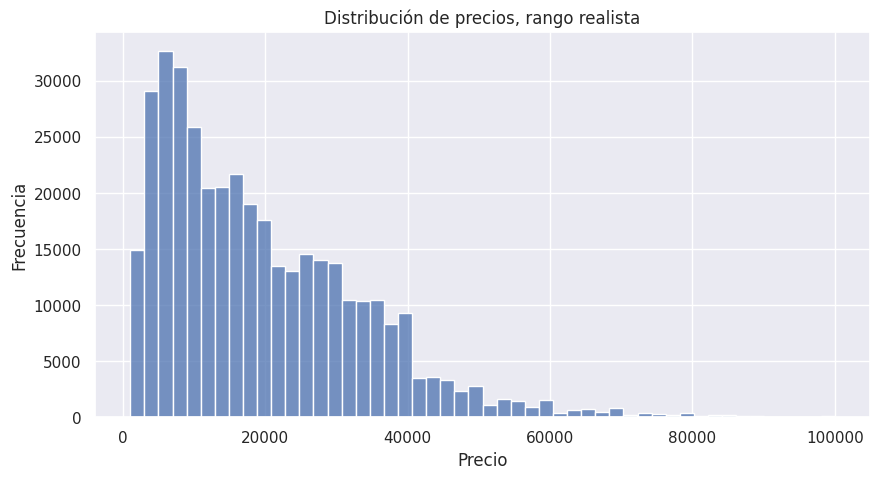
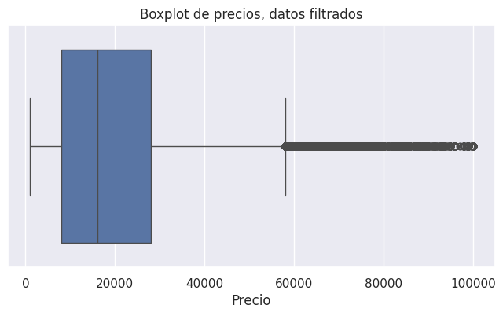
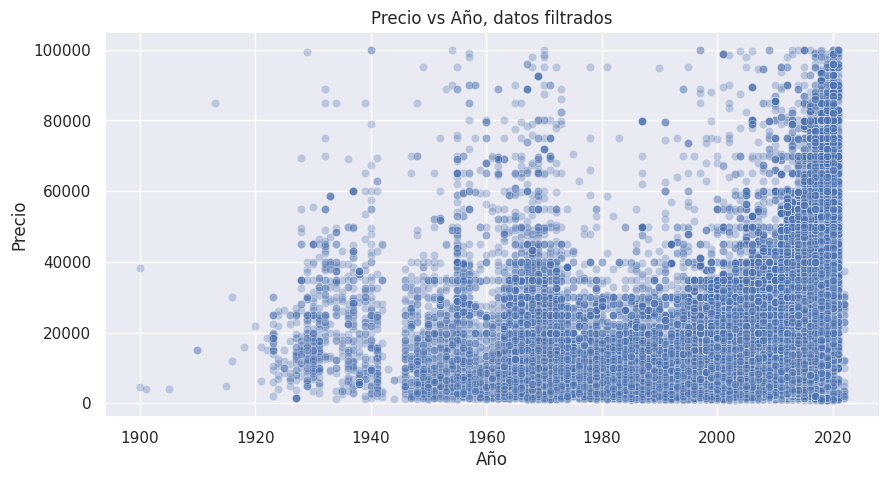
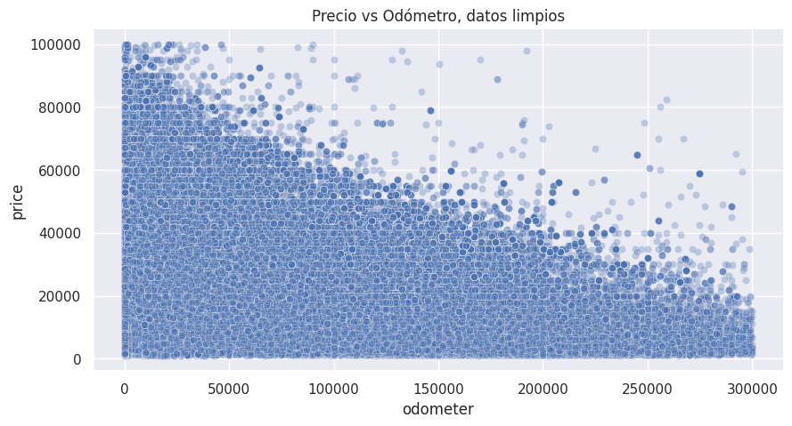
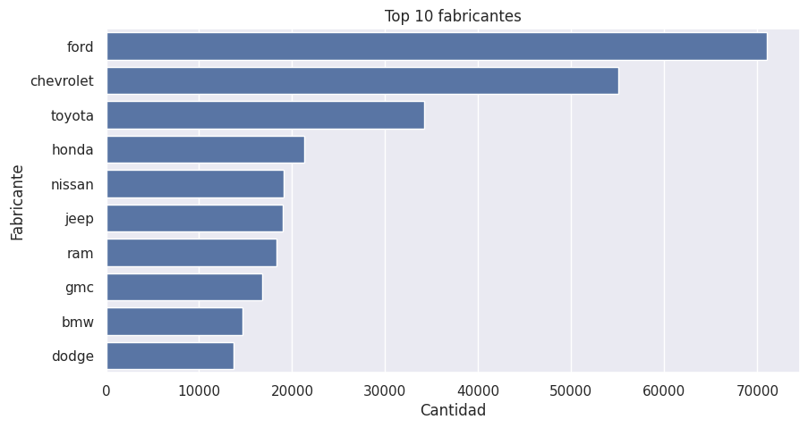
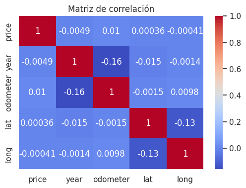
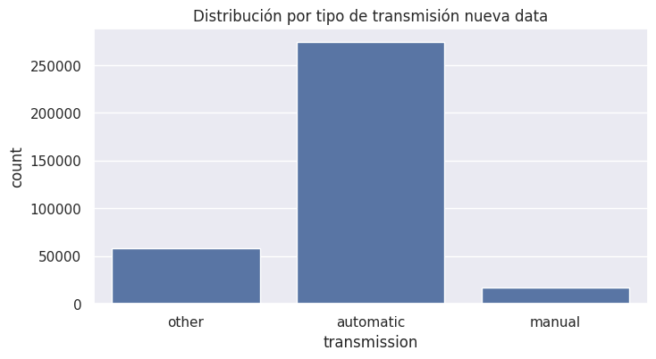
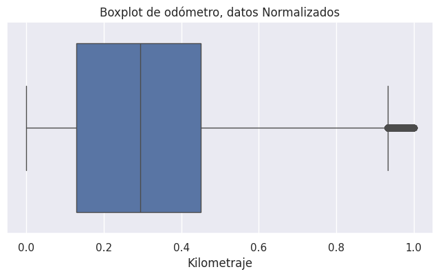

# Data Quality Report - Vehículos Usados

**Autor: Celso Farías**

Primer reporte del proyecto, correspondiente planteamiento del problema, descripción del dataset, análisis exploratorio de los datos; o EDA; y preprocesamiento.

---

## 1. Introducción

En el mercado de vehículos usados, la correcta tasación de un automóvil representa un desafío tanto para empresas como para usuarios particulares. La determinación del precio suele depender de criterios subjetivos o herramientas limitadas, generando inconsistencias en la valorización.

En este contexto, el presente proyecto aborda esta problemática desde una perspectiva de ciencia de datos, con el objetivo de analizar un conjunto de datos reales de vehículos en venta y sentar las bases para la construcción de un modelo capaz de estimar precios de forma más objetiva y consistente.

Este reporte corresponde al análisis de calidad de datos y exploración inicial, permitiendo comprender la estructura, limitaciones y potencial del dataset, así como fundamentar las decisiones de preprocesamiento necesarias para etapas posteriores.

---

## 2. Descripción del Dataset

Se utiliza el dataset **Craigslist Cars and Trucks Data**, obtenido desde Kaggle, el cual contiene información sobre vehículos en venta en distintas regiones.

El conjunto de datos cuenta inicialemente con:

- 426880 registros  
- 26 variables  

Incluye variables relevantes para el análisis, tales como:

- price; precio del vehículo  
- year; año de fabricación  
- manufacturer; fabricante  
- model; modelo  
- odometerv kilometraje  
- fuel; tipo de combustible  
- transmission; tipo de transmisión  
- condition; estado del vehículo  
- state, lat, long; variables geográficas  

La relación entre el dataset y el problema es directa, ya que se dispone de la variable objetivo precio junto con múltiples variables explicativas que influyen en su determinación.

---

## 3. Calidad de Datos

### 3.1 Completitud

El dataset presenta distintos niveles de completitud según la variable analizada.

Se identifican tres grandes grupos:

- Variables completas o casi completas  
  price, region, state presentan un 0 por ciento de valores nulos  

- Variables con bajo nivel de valores faltantes  
  year, manufacturer, model, odometer, fuel, transmission presentan menos de 5 por ciento de nulos  

- Variables con alta incompletitud  
  condition, cylinders, VIN, drive, paint_color y size presentan porcentajes elevados de valores faltantes  

Destaca particularmente la variable county, la cual presenta un 100% de valores nulos, por lo que no aporta información útil y se descarta completamente.

---

### 3.2 Valores Nulos

El análisis de valores faltantes permite identificar distintas problemáticas:

- size presenta aproximadamente un 71.7 por ciento de valores nulos  
- cylinders cerca de un 41.6 por ciento  
- condition un 40.7 por ciento  
- VIN un 37.7 por ciento  
- drive y paint_color alrededor de un 30.5 por ciento  

Estas variables representan un desafío, ya que su alto nivel de incompletitud dificulta su uso directo en el análisis.

Por otro lado, variables clave como year, manufacturer, model y odometer presentan bajos niveles de valores faltantes, lo que permite su utilización con un tratamiento mínimo o mediante eliminación de registros incompletos.

En general, la presencia de valores nulos evidencia la necesidad de aplicar estrategias diferenciadas de limpieza, imputación o eliminación de variables.

---

### 3.3 Outliers

El análisis estadístico del dataset evidencia la presencia de valores atípicos significativos en variables clave.

En la variable price se observa:

- promedio de 75199  
- mediana de 13950  
- valor máximo de 3736928711  

Esta diferencia extrema entre media y mediana indica una distribución fuertemente sesgada, confirmando la existencia de valores irreales dentro del dataset.

De manera similar, la variable odometer presenta valores máximos cercanos a 10000000, lo cual resulta poco realista para el kilometraje de un vehículo.

En cuanto a la variable year, se identifican valores mínimos como 1900, los cuales pueden corresponder a registros erróneos o casos no representativos del mercado actual.

Por su parte, las variables geográficas lat y long presentan valores extremos que podrían indicar errores de localización.

---

### 3.4 Visualización de Outliers y Distribuciones

A continuación se presentan algunas visualizaciones clave que permiten comprender mejor la distribución de los datos y la presencia de valores atípicos.

#### Distribución de precios



Se aprecia de mejor forma que los precios están concentrados principalmente entre los 5000 y 20000 dólares, mientras que valores extremos distorsionan la escala general.

---

#### Boxplot de precios



Gran parte de los precios se encuentra dentro de un rango acotado, evidenciando que los valores extremos corresponden a outliers que deben ser tratados.

---

#### Precio vs Año



Se observa que, en general, los vehículos más modernos tienden a ser más costosos, como es de esperar. No obstante, existen registros que escapan a este patrón, como ciertas concentraciones en las décadas de los 50s o 70s, verdaderas joyitas del mundo automotriz.

---

#### Precio vs Odómetro



Como es totalmente esperable, a medida que un vehículo aumenta su kilometraje, su valor disminuye de forma considerable.

---

#### Fabricantes más frecuentes



Se observa una alta presencia de fabricantes como Ford, Chevrolet y Toyota, lo que indica que el dataset está dominado por estos gigantes del mercado.

---

#### Matriz de correlación



En un análisis inicial, podría parecer que ninguna variable se relaciona fuertemente de forma individual con el precio. Sin embargo, esto sugiere que el valor de un vehículo no depende de una única variable, sino de la interacción de múltiples factores. Siendo así, el precio es el resultado de una compleja combinación de variables, como todo en este santo mundo.


Para una visualización completa del análisis exploratorio véase el notebook `01_EDA`presente en la carpeta `notebooks` del presente repositorio.

--- 


## 4. Consistencia

La consistencia de los datos se refiere a la coherencia lógica y validez de los valores dentro del dataset, asegurando que estos representen correctamente la realidad del fenómeno estudiado.

En el análisis realizado, se identificaron múltiples inconsistencias relevantes:

- Valores de precio extremadamente altos o iguales a cero, los cuales no representan el comportamiento real del mercado.
- Registros con kilometrajes excesivos, alcanzando valores poco realistas.
- Años de fabricación fuera de rangos razonables, incluyendo valores como 1900.
- Coordenadas geográficas con valores extremos que podrían indicar errores de registro.

Estas inconsistencias reflejan la naturaleza del dataset, el cual proviene de publicaciones reales y no estructuradas, donde los datos pueden contener errores humanos o registros anómalos.

Para abordar estos problemas, se aplicaron filtros que permiten restringir el análisis a valores coherentes y representativos del mercado actual, mejorando así la calidad del dataset y la confiabilidad de los resultados posteriores.

---

## 5. Análisis Exploratorio de Datos y Variables

El análisis exploratorio comprende la estructura del dataset, identificando patrones relevantes y evaluando la utilidad de cada variable en relación con el precio.

En términos de cardinalidad, se observa que variables como model presentan una alta diversidad de valores, reflejando la gran variedad de vehículos disponibles en el mercado. Por otro lado, variables como transmission, fuel y condition presentan baja cardinalidad, lo que facilita su uso en modelos predictivos.

Se identificaron variables que no aportan valor analítico, tales como id, url, image_url y description, las cuales corresponden a identificadores o datos no estructurados.

Asimismo, la variable VIN presenta una alta cardinalidad, funcionando en la práctica como un identificador único, por lo que su utilidad en el análisis es limitada.

En cuanto a relaciones entre variables, se observan patrones esperables:

- A mayor año del vehículo, mayor es su precio.
- A mayor kilometraje, menor es el valor del vehículo.
- Los fabricantes más comunes corresponden a grandes marcas como Ford, Chevrolet y Toyota.

No obstante, la matriz de correlación muestra que ninguna variable por sí sola explica completamente el precio, lo que sugiere que este depende de la interacción de múltiples factores.

En conjunto, el EDA permitió identificar variables relevantes, descartar aquellas sin valor analítico y comprender las relaciones fundamentales dentro del dataset.
Mencionar todo esto suena repetitivo, sí, no obstante es importante para su comprensión, internamiento y posterior toma de decisiones.

---

## 6. Decisiones de Preprocesamiento


A partir del análisis de calidad de datos y del EDA, se definieron una serie de decisiones orientadas a limpiar, estructurar y preparar el dataset para etapas posteriores de modelamiento.

En primer lugar, se eliminaron columnas irrelevantes o con bajo valor analítico, tales como `id`, `url`, `region_url`, `image_url`, `description`, `size`, `VIN`, `region` y `county`, debido a su naturaleza no informativa o alto porcentaje de valores faltantes.

Posteriormente, se aplicaron filtros para asegurar la consistencia de los datos:

- Se consideraron únicamente precios mayores a cero.
- Se filtraron valores de odómetro entre 0 y 300000, rango donde se concentra la mayoría de los datos.
- Se restringió el año de fabricación entre 1980 y 2024, asegurando la relevancia de los registros.

Luego de estos filtros, el dataset se reduce a aproximadamente 364151 registros y 20 variables.

En cuanto al tratamiento de valores faltantes, se adoptaron distintas estrategias según la importancia de las variables:

- Se eliminaron registros con valores nulos en `year`, `manufacturer`, `model` y `odometer`, debido a su relevancia crítica en la estimación del precio, siendo así; no se pueden "inventar" datos a estas categorías.
- Se imputaron valores faltantes en variables categóricas como `condition`, `cylinders`, `drive`, `paint_color` y `type` utilizando la categoría `"unknown"`, con el fin de preservar información sin introducir sesgos artificiales.
- En las variables `fuel` y `transmission`, se utilizó imputación por moda, al presentar bajos niveles de valores faltantes.

Posteriormente, se transformaron variables categóricas como `manufacturer`, `fuel`, `transmission`, `type` y `condition` a formato numérico mediante técnicas de codificación. Para evitar redundancias y problemas de multicolinealidad, se utilizó el parámetro `drop_first=True`, el cual elimina una categoría por variable, dejándola representada de forma implícita como referencia base... Porque a veces lo esencial es invisible a los ojos, y por más que no se vea, ahí está, solo se debe tener fe.

En cuanto al desbalance presente en variables categóricas como `manufacturer` y `transmission`, si bien se mantiene una distribución desigual entre categorías, no se considera necesario aplicar técnicas adicionales de balanceo. Dado que el problema abordado corresponde a una regresión, el modelo es capaz de aprender relaciones continuas sin verse críticamente afectado por la frecuencia relativa de las categorías, por lo que intervenir estos datos podría introducir mayor distorsión que beneficio.

Finalmente, se aplicó un proceso de normalización Min-Max sobre las variables numéricas `price`, `odometer` y `year`, transformando sus valores al rango [0,1]. Este procedimiento permite homogenizar la escala de las variables, evitando que aquellas con magnitudes mayores dominen el aprendizaje del modelo y facilitando la convergencia de los algoritmos. Cabe destacar que, al incluir la variable objetivo `price` en este proceso, será necesario aplicar una transformación inversa para interpretar los resultados en su escala original.

En conjunto, estas decisiones permiten obtener un dataset limpio, consistente y preparado para la construcción de modelos predictivos.

Ya para este punto el dataset queda con una totalidad de 349623 registros y 77 columnas, aumentando estas últimas tras la codificación de las variables categóricas. Para mayor detalle véase el notebook `02_preprocesamiento` en la carpeta `notebooks` del presente repositorio.

El dataset procesado final se encuentra disponible en la ruta `data/processed/` dentro del repositorio.

En cuanto a los registros eliminados por tener precios nulos, y según lo discutido el día 02 de abril, se decidió utilizarlos en los tests del futuro modelo de regresión a desarrollar.

---

### 6.1 Análisis Exploratorio sobre Data Procesada

A continuación, se presentan visualizaciones generadas a partir del dataset ya procesado, con el objetivo de comprender su estructura final antes del modelamiento.

### Distribución de fabricantes  


Como se aprecia, el dataset continúa siendo dominado por los tres colosos del mundo automotriz: Ford, Chevrolet y Toyota. No obstante, la cantidad de registros se reduce tras la limpieza aplicada, manteniendo las proporciones generales pero con menor volumen absoluto.

---

### Distribución del combustible  


Las cantidades de cada tipo de combustible disminuyen tras el preprocesamiento, pero conservan sus proporciones relativas. A pesar del desbalance, no se aplican transformaciones adicionales, dado que no representa un problema crítico en un contexto de regresión.

---

### Distribución de precios  


La distribución de los precios mantiene su forma general, aunque ahora representada en una escala normalizada. El proceso de Min-Max comprime la mayoría de los valores en un rango reducido, mientras extiende la cola de la distribución dentro del nuevo intervalo.

---

### Boxplot del odómetro  


Se observan valores que podrían interpretarse como extremos; sin embargo, estos son menos frecuentes que en la data original. Se decide conservarlos, ya que aportan información relevante para que el modelo aprenda comportamientos asociados a vehículos con alto kilometraje.

---

### Distribución de años  


Se aprecian “saltos” en la distribución, lo cual responde a la naturaleza discreta de la variable `year`. Al ser normalizada, la separación entre valores se vuelve más evidente, revelando la estructura escalonada que antes quedaba difuminada por la escala original.

---

### Relación precio vs odómetro  


La relación entre precio y kilometraje mantiene su patrón general incluso tras la normalización. Esto indica que el proceso de escalado no altera las relaciones subyacentes entre variables, sino únicamente su representación.

### 6.2 Aclaraciones

1. para mayor información y detalle de este preprocesamiento véase `02_preprocesamiento_Primer_avance_CD_autos.ipynb` en la carpeta `notebooks` dentro de este mismo repositorio.
2. Dado el tamaño de ~170mb del dataset procesado no se puede subir a github. De este modo se ha subido a kaggle, disponible en: https://www.kaggle.com/datasets/celsofariasaraya/vehicules-processed-celso. Desde allí se usará en las práximas estapas del proyecto. Se ha agregado esta consideracion al archivo `.gitignore`para que no subirlo al repositorio de allí.
---

## 7. Riesgos y Limitaciones

A pesar de la utilidad del dataset y del proceso de limpieza aplicado, existen una serie de riesgos y limitaciones que deben ser considerados al momento de interpretar los resultados y desarrollar modelos predictivos.

En primer lugar, el dataset proviene de publicaciones reales en una plataforma abierta, lo que implica que los datos no han sido generados bajo un control estricto de calidad. Esto introduce la posibilidad de errores humanos, datos incompletos y registros inconsistentes. Como se ha evidenciado.

Asimismo, la presencia de valores faltantes en múltiples variables obliga a tomar decisiones de imputación o eliminación, lo que puede introducir sesgos en el análisis. En particular, la imputación de categorías como "unknown" puede afectar la interpretación de ciertas variables dentro del modelo.

Otro aspecto relevante es la existencia de outliers, especialmente en variables como precio y kilometraje. Si bien estos han sido parcialmente tratados mediante filtros, siempre existe el riesgo de eliminar casos válidos o mantener registros que distorsionen el comportamiento real del mercado.

En cuanto a la representatividad, el dataset se encuentra dominado por ciertos fabricantes como Ford, Chevrolet y Toyota, lo que podría generar un sesgo hacia estos segmentos del mercado, limitando la capacidad del modelo para generalizar correctamente a marcas menos frecuentes.

Por otro lado, variables potencialmente relevantes como description o características más detalladas del vehículo no son utilizadas en el análisis debido a su naturaleza no estructurada, lo que implica una pérdida de información que podría ser valiosa en un enfoque más avanzado, y no lo sabremos hasta no intentarlo.

Por último, es importante considerar que el precio de un vehículo depende de múltiples factores externos no incluidos en el dataset, tales como el estado real del vehículo, el contexto económico o la ubicación específica del mercado, lo que limita el alcance predictivo del modelo.

En conjunto, estos factores evidencian que, si bien el dataset permite desarrollar soluciones útiles, los resultados deben ser interpretados con criterio y entendiendo las limitaciones inherentes a los datos utilizados.

---

## 8. Pipeline de Datos

El pipeline de datos considera, para este primer reporte, desde la obtención de los datos hasta el preprocesamiento realizado a los mismos, siendo así...

El flujo implementado en este proyecto es el siguiente:

**Fuente de datos**  
El dataset es obtenido desde Kaggle, específicamente del repositorio Craigslist Cars and Trucks Data, el cual contiene información real de vehículos en venta. Véase el enlace adjunto en el README principal del repositorio.

**Ingesta de datos**  
Los datos son cargados y trabajados inicialmente en Google Colab, permitiendo su manipulación mediante herramientas de análisis de datos en Python.

**Capa Raw**  (REVISAR)
Los datos originales son almacenados sin modificaciones en la carpeta `data/raw` del repositorio, permitiendo mantener una copia íntegra de la fuente original.

**Procesamiento y análisis**  
El análisis exploratorio de datos y el preprocesamiento se realizan en notebooks separados dentro de la carpeta `notebooks`, permitiendo una organización clara del flujo de trabajo.

- 01_EDA, correspondiente al análisis exploratorio de datos  
- 02_preprocesamiento, correspondiente a la limpieza y transformación de datos  

**Capa Curated**  
Los datos procesados, limpios y estructurados son almacenados en data/processed, quedando listos para su uso en etapas de modelamiento.

**Consumo de datos**  
El dataset limpio será utilizado posteriormente para la construcción de modelos de regresión que permitan estimar el precio de vehículos.

**Versionado y reproducibilidad**  
El proyecto se encuentra versionado mediante GitHub, lo que permite llevar un control de cambios y asegurar la trazabilidad del desarrollo.

La estructura del repositorio separa claramente los datos crudos, los datos procesados, los notebooks y los reportes, facilitando la comprensión del proyecto y su replicabilidad.

Además, el uso de notebooks permite documentar cada paso del proceso, asegurando que los resultados puedan ser reproducidos por terceros.
visualmente el pipeline quedaría:

### Pipeline de Datos
**Simple:** 
```
Kaggle → Ingesta Colab → data/raw → EDA → Preprocessing → data/processed → Modelos → Consumo
```

**Explicativo:**

```
Kaggle Dataset; obtención de data  
↓  
Ingesta en Google Colab; inyección  
↓  
data/raw; datos originales sin modificar, notebook 00  
↓  
Notebook 01 EDA; análisis exploratorio  
↓  
Notebook 02 Preprocessing; limpieza y transformación  
↓  
data/processed; datos limpios y estructurados  
↓  
Modelamiento; regresión para predicción de precios  
↓  
Consum; sistema de estimación de precios
```
---

Este pipeline permite estructurar el flujo de datos de manera clara y ordenada, asegurando que cada etapa del proceso sea comprensible, replicable y mantenible en el tiempo.