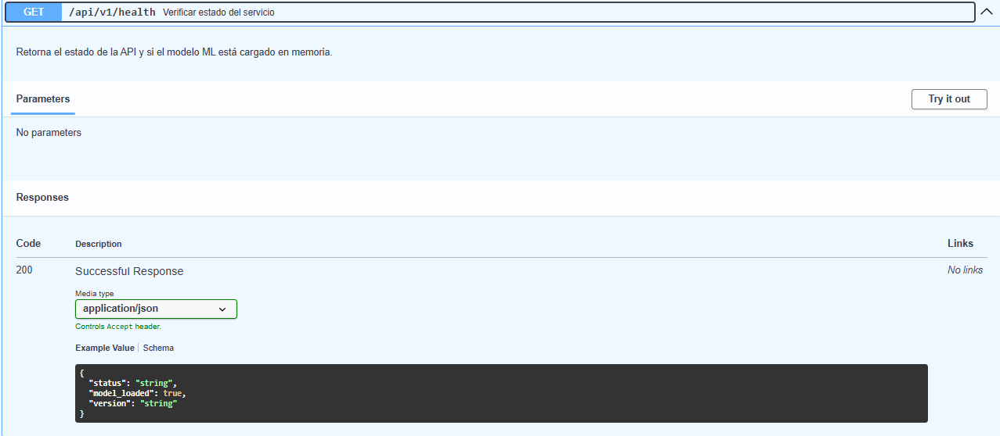
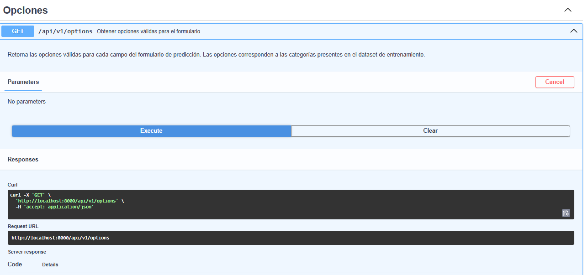
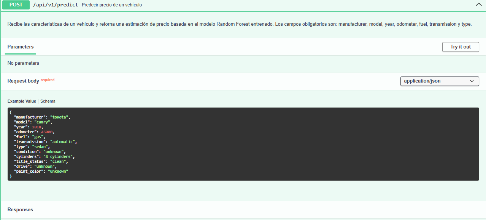
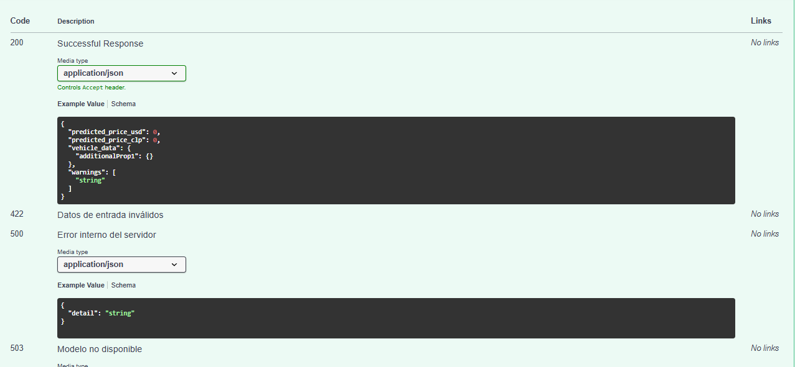
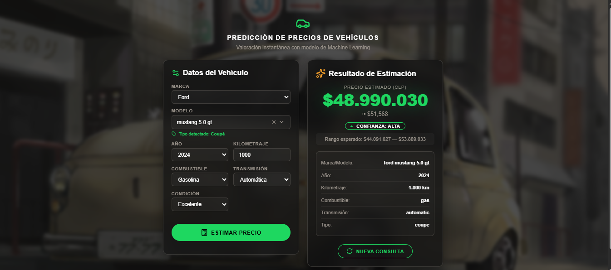
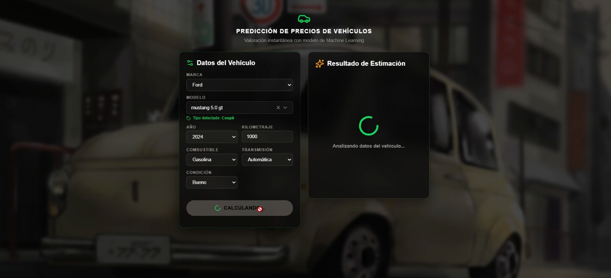
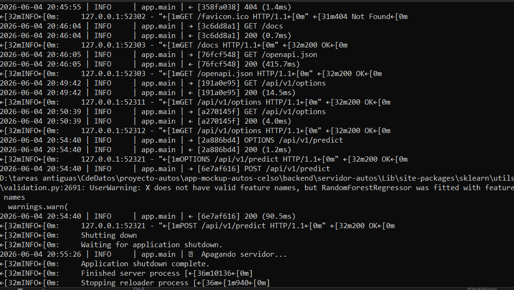
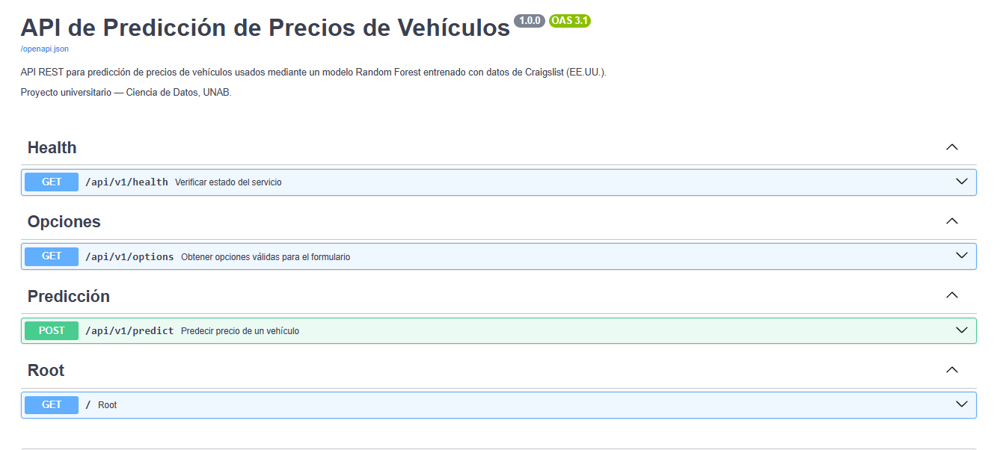
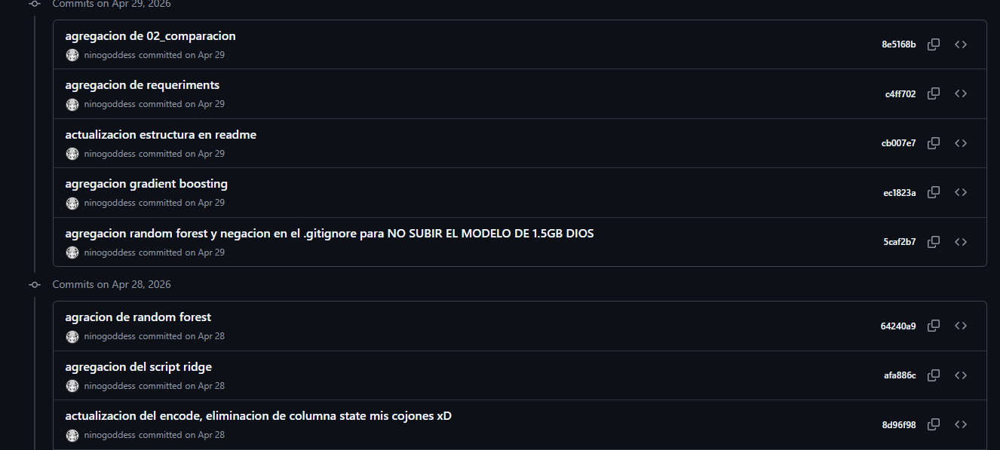

# 05_informe_despliegue.md

### Proyecto de Regresión de Precios de Vehículos — Hito 2

**Autor:** Celso Farías  
**Carrera:** Ingeniería Civil Informática  
**Universidad:** Andrés Bello, sede Viña del Mar  
**Fecha:** 04 de Junio de 2026

---

## 1. Implementación de Mejoras del Hito 1

El Hito 1 estableció las bases del proyecto: análisis exploratorio, preprocesamiento y entrenamiento de modelos. Las observaciones recibidas en esa instancia dieron forma al desarrollo del Hito 2.

### 1.1 Cambios aplicados

**Lenguaje técnico:** Los reportes anteriores combinaban redacción técnica con elementos narrativos, poéticos y feflexivos. A partir del Hito 2, la documentación adopta un estilo técnico formal, directo y estructurado, más alineado con estándares de ingeniería de software. Murió la Flor.

... en la medida que sea posible, claro.

**Despliegue local:** En lugar de depender de servicios externos como Vercel para el backend, el sistema opera completamente en la máquina local. Esta decisión fue técnicamente motivada por el tamaño del modelo Random Forest (~1.5 GB), que supera los límites de memoria de los servicios gratuitos disponibles. El análisis comparativo de plataformas se encuentra en `app-mockup-autos-celso/docs/DEPLOYMENT_ANALYSIS.md`.

**Refinamiento del frontend:** El mockup no funcional del Hito 1 fue reemplazado por una interfaz funcional completa, conectada al backend mediante Axios, con estados de carga, manejo de errores, animaciones, fondo personalizado y diseño responsive.

**Integración real del modelo:** La predicción ya no es simulada. Cada solicitud del usuario atraviesa el pipeline completo: validación, preprocesamiento, inferencia con el modelo entrenado y desnormalización del resultado.

---

## 2. Arquitectura del Sistema en Localhost

### 2.1 Descripción general

El sistema está compuesto por dos componentes independientes que se comunican mediante HTTP REST sobre la red local:

```
┌──────────────────────────────────────────────────────────────┐
│                    MÁQUINA LOCAL                             │
│                                                              │
│  ┌─────────────────────┐       ┌──────────────────────────┐  │
│  │   Frontend (React)  │       │   Backend (FastAPI)      │  │
│  │   localhost:5173    │──────►│   localhost:8000         │  │
│  │                     │  HTTP │                          │  │
│  │   - Formulario      │◄──────│   - /api/v1/predict      │  │
│  │   - Validación      │  JSON │   - /api/v1/options      │  │
│  │   - Resultados      │       │   - /api/v1/health       │  │
│  └─────────────────────┘       └──────────┬───────────────┘  │
│                                           │                  │
│                              ┌────────────▼───────────────┐  │
│                              │   Artefactos ML (en disco) │  │
│                              │                            │  │
│                              │   model.pkl (~1.5 GB)      │  │
│                              │   model_encoding_map.csv   │  │
│                              │   scaler_params.json       │  │
│                              │   models_by_manufacturer   │  │
│                              │   model_type_map.json      │  │
│                              └────────────────────────────┘  │
└──────────────────────────────────────────────────────────────┘
```

### 2.2 Diagrama de flujo de predicción

```
Usuario ingresa datos
        │
        ▼
[PredictionForm.jsx]
Validación client-side
(campos requeridos, rangos)
        │
        ▼
[predictionService.js]
POST http://localhost:8000/api/v1/predict
        │
        ▼
[FastAPI — Validación Pydantic]
Sanitización: strip, lowercase, rangos
422 si inválido
        │
        ▼
[Motor de Preprocesamiento]
1. MinMax: year, odometer → [0,1]
2. StandardScaler (parámetros recuperados)
3. Target Encoding: model → valor numérico
4. One-Hot Encoding: manufacturer, fuel,
   transmission, condition, drive, etc.
5. Vector de 91 features
        │
        ▼
[Random Forest — Inferencia]
91 features → valor predicho (escala StandardScaler)
        │
        ▼
[Desnormalización]
StandardScaler⁻¹ → MinMax⁻¹ → precio en USD
USD × tasa_cambio → CLP
        │
        ▼
[Respuesta JSON]
{predicted_price_usd, predicted_price_clp, warnings}
        │
        ▼
[ResultPanel.jsx]
Animación de precio + detalles del vehículo
```

### 2.3 Componentes y responsabilidades

| Componente | Tecnología | Puerto | Responsabilidad |
|------------|------------|--------|----------------|
| Frontend | React 19 + Vite 8 | 5173 | Interfaz de usuario, validación client-side, visualización de resultados |
| Backend | FastAPI + Uvicorn | 8000 | API REST, validación server-side, preprocesamiento, inferencia |
| Modelo ML | scikit-learn RandomForest | — | Predicción de precio (cargado en memoria RAM al inicio) |
| Artefactos | Archivos JSON/CSV/PKL | — | Parámetros del scaler, encoding maps, modelo entrenado |

---

## 3. API REST — Endpoints Implementados

### 3.1 GET /api/v1/health

Verifica el estado operativo del servicio y confirma que el modelo está cargado en memoria.

**Request:** Sin parámetros

**Response (200):**
```json
{
  "status": "ok",
  "model_loaded": true,
  "version": "1.0.0"
}
```

**Health check en navegador:**



---

### 3.2 GET /api/v1/options

Retorna las opciones válidas para cada campo del formulario, extraídas del dataset de entrenamiento.

**Request:** Sin parámetros

**Response (200) — Fragmento:**
```json
{
  "manufacturers": ["acura", "alfa-romeo", "audi", "bmw", ...],
  "models_by_manufacturer": {
    "toyota": ["camry", "corolla", "highlander", ...],
    "ford": ["bronco", "escape", "f-150", ...]
  },
  "fuels": ["diesel", "electric", "gas", "hybrid", "other"],
  "transmissions": ["automatic", "manual", "other"],
  "types": ["SUV", "bus", "convertible", "coupe", ...]
}
```

**Respuesta de /options en Swagger:**



---

### 3.3 POST /api/v1/predict

Endpoint principal. Recibe características del vehículo y retorna el precio estimado.

**Request Body:**
```json
{
  "manufacturer": "toyota",
  "model": "camry",
  "year": 2018,
  "odometer": 45000,
  "fuel": "gas",
  "transmission": "automatic",
  "type": "sedan",
  "condition": "good"
}
```

**Response (200):**
```json
{
  "predicted_price_usd": 15200.50,
  "predicted_price_clp": 14440475,
  "vehicle_data": {
    "manufacturer": "toyota",
    "model": "camry",
    "year": 2018,
    "odometer": 45000,
    "fuel": "gas",
    "transmission": "automatic",
    "type": "sedan",
    "condition": "good"
  },
  "warnings": []
}
```

**Response (422 — Datos inválidos):**
```json
{
  "detail": [
    {
      "field": "year",
      "message": "Input should be less than or equal to 2024"
    }
  ]
}
```

**POST /predict exitoso en Swagger:**



**Códigos en Swagger:**



---

## 4. Integración Frontend y Backend

### 4.1 Capa de comunicación

La integración se realiza a través de `predictionService.js`, que centraliza todas las llamadas HTTP mediante Axios. Los componentes React nunca llaman directamente a la API; solo interactúan con este servicio.

```
PredictionForm → useVehicleForm → handleSubmit
                                        │
                                        ▼
                             predictionService.predictPrice()
                                        │
                             axios.post('/api/v1/predict')
                                        │
                                        ▼
                              Backend FastAPI
```

### 4.2 Flujo de interacción

1. Al cargar la aplicación, el frontend llama a `GET /api/v1/options` para poblar los selectores del formulario.
2. Al seleccionar una marca, el frontend filtra los modelos disponibles del mapa `models_by_manufacturer` (sin consultar el backend nuevamente).
3. Al seleccionar un modelo, el tipo de vehículo se detecta automáticamente desde `model_type_map` (sin campo visible para el usuario).
4. Al enviar el formulario, el frontend valida los datos localmente y envía `POST /api/v1/predict`.
5. Durante la espera, se muestra un spinner con mensajes rotativos.
6. El resultado se presenta con animación de contador y detalles del vehículo.

### 4.3 Manejo de errores en la integración

| Escenario | Código | Comportamiento en el frontend |
|-----------|--------|------------------------------|
| Datos inválidos | 422 | Mensajes de error por campo |
| Modelo no cargado | 503 | "Servicio no disponible" |
| Error interno | 500 | "Error del servidor. Intenta más tarde." |
| Sin conexión | — | "No se pudo conectar con el servidor" |
| Timeout (>15s) | — | "La solicitud tardó demasiado" |

**Interfaz con predicción exitosa:**



**Interfaz con error de conexión:**


---

## 5. Evidencia de Funcionamiento

### 5.1 Flujo completo de ejecución

**Formulario completado antes de enviar:**


**Estado de carga, spinner:**



**Logs del backend mostrando requests:**



Los logs del backend registran cada request con el siguiente formato:
```
2026-06-04 12:30:15 | INFO     | app.main | → [a3f1bc20] POST /api/v1/predict
2026-06-04 12:30:15 | INFO     | app.main | ← [a3f1bc20] 200 (342.5ms)
```

### 5.2 Documentación interactiva, Swagger

FastAPI genera documentación interactiva automáticamente en `http://localhost:8000/docs`.

**Vista general de Swagger UI:**



Desde Swagger es posible:
- Ver todos los endpoints disponibles
- Inspeccionar schemas de entrada y salida
- Ejecutar requests directamente desde el navegador
- Verificar respuestas en tiempo real

### 5.3 Pruebas de validación

El sistema rechaza correctamente entradas inválidas:

| Entrada | Respuesta esperada |
|---------|-------------------|
| `year: 1900` | 422 — año fuera de rango |
| `odometer: -500` | 422 — kilometraje negativo |
| `fuel: ""` | 422 — campo vacío |
| `manufacturer: ""` | 422 — campo obligatorio |

**Prueba de validación con campos faltantes:**


---

## 6. Evaluación Técnica del Despliegue

### 6.1 Tiempos de respuesta medidos

| Operación | Tiempo medido | Observación |
|-----------|--------------|-------------|
| Inicio del servidor, carga del modelo | ~20-30 segundos | Solo al iniciar, no en cada request |
| GET /api/v1/health | < 10 ms | Sin procesamiento pesado |
| GET /api/v1/options | < 50 ms | Datos en memoria, sin disco |
| POST /api/v1/predict | 100–400 ms | Preprocesamiento + inferencia |

El tiempo de carga inicial de ~30 segundos corresponde a la deserialización del modelo de 1.5 GB con joblib. Una vez en memoria, las predicciones son rápidas porque Random Forest aplica reglas de decisión, no operaciones matriciales costosas. No olvidemos que toda ejecución y prueba ha sido de forma local. 

### 6.2 Funcionamiento de endpoints

Todos los endpoints fueron probados y responden correctamente:

- `/health` retorna `"status": "ok"` con modelo cargado
- `/options` retorna 41 marcas, ~19.800 modelos agrupados, combustibles, transmisiones y tipos
- `/predict` retorna precio en USD y CLP con advertencias cuando corresponde

### 6.3 Estabilidad

El servidor opera de forma estable bajo condiciones normales de uso. Se han considerado los siguientes escenarios:

- **Modelo no encontrado:** El servidor inicia en modo degradado y reporta el error en `/health` sin crashear.
- **Input inválido:** Pydantic intercepta y retorna 422 antes de llegar al modelo.
- **Error en inferencia:** El servicio retorna 503 con mensaje descriptivo.
- **Excepción no controlada:** El handler global retorna 500 sin exponer detalles internos.

---

## 7. Organización del Repositorio GitHub

### 7.1 Estructura del repositorio

```
proyecto-autos/
├── app-mockup-autos-celso/         ← Sistema web completo, Hito 2
│   ├── src/                        ← Código fuente del frontend
│   │   ├── components/             ← Componentes React
│   │   ├── hooks/                  ← Hooks personalizados
│   │   ├── services/               ← Capa de comunicación HTTP
│   │   └── constants/              ← Traducciones y constantes
│   ├── backend/                    ← API FastAPI
│   │   ├── app/
│   │   │   ├── config/             ← Configuración centralizada
│   │   │   ├── routers/            ← Endpoints de la API
│   │   │   ├── services/           ← Lógica de negocio
│   │   │   ├── schemas/            ← Modelos Pydantic
│   │   │   └── utils/              ← Cargador de modelo y utilidades
│   │   ├── artifacts/              ← Artefactos ML generados
│   │   └── scripts/                ← Scripts de generación de artefactos
│   ├── public/                     ← Assets estáticos del frontend
│   └── docs/                       ← Documentación técnica
├── data/
│   ├── raw/                        ← Dataset original
│   └── processed/                  ← Datasets procesados
├── models/                         ← Modelos entrenados .pkl
├── notebooks/                      ← Análisis y preprocesamiento
├── reports/                        ← Informes técnicos
├── results/                        ← Métricas de entrenamiento
└── src/                            ← Scripts de entrenamiento
```

### 7.2 Estado del repositorio

El repositorio mantiene un historial de commits organizado por fases del proyecto:
- Fase 1: Análisis y arquitectura
- Fase 2: Backend FastAPI
- Fase 3: Frontend e integración
- Fase 4: Seguridad y buenas prácticas
- Fase 5: Despliegue local y refinamiento

**Extracto del Historial de commits en GitHub:**



---

## 8. Seguridad y Buenas Prácticas

### 8.1 Validación de datos

La validación opera en dos capas:

**Client-side o frontend:**
- Campos obligatorios antes de enviar
- Rangos: año entre 1981 y 2024, kilometraje entre 1 y 299.999
- Feedback visual inmediato con mensajes por campo
- Botón deshabilitado durante el envío, previene doble submit

**Server-side o backend:**
- Pydantic valida tipos, rangos y longitudes máximas
- `field_validator` normaliza strings: strip + lowercase
- Fallbacks seguros para campos opcionales, condition, drive → "unknown"
- Rechazo de strings vacíos o solo espacios

### 8.2 Manejo de errores

Los errores se gestionan en capas sin exponer información sensible:

- **422:** Errores de validación con campo y mensaje descriptivo
- **503:** Modelo no disponible, mensaje genérico
- **500:** Error interno, mensaje genérico, sin stack trace
- **Frontend:** Categoriza errores de red, timeout y servidor por separado

### 8.3 Configuración y variables de entorno

- Todas las configuraciones sensibles están en archivos `.env` (excluidos del repositorio via `.gitignore`)
- `.env.example` documenta las variables sin valores reales
- CORS configurado explícitamente (no `allow_origins=["*"]`)
- Logging estructurado con nivel configurable (DEBUG/INFO/WARNING)

### 8.4 Estructura modular

**Backend:**
- `routers/`: Manejo HTTP, sin lógica de negocio
- `services/`: Lógica de predicción y preprocesamiento
- `schemas/`: Contratos de datos, Pydantic
- `config/`: Configuración centralizada con dotenv
- `utils/`: Cargador de artefactos ML

**Frontend:**
- `components/`: Componentes visuales con responsabilidad única
- `hooks/`: Lógica de estado del formulario `useVehicleForm`
- `services/`: Comunicación HTTP centralizada `predictionService.js`
- `constants/`: Traducciones y valores constantes

### 8.5 Logging profesional

El backend registra cada request con ID único y tiempo de respuesta:

**Ejemplo extracto**:
```
2026-06-04 12:30:15 | INFO | → [a3f1bc20] POST /api/v1/predict
2026-06-04 12:30:15 | INFO | ← [a3f1bc20] 200 (342.5ms)
```

No se registran datos del usuario como marcas, modelos, precios; para proteger la privacidad.

---

## 9. Redacción y Lenguaje Técnico

Este informe ha sido redactado siguiendo criterios de claridad técnica, con terminología precisa y sin ambigüedades. La estructura sigue el estándar de informes de ingeniería de software, con secciones claramente delimitadas, tablas comparativas y diagramas ASCII que complementan las descripciones textuales. Me cortaron las alas, más no la cabeza.

---

## 10. Referencias

Reese, A. (2021). *Craigslist cars and trucks data* [Dataset]. Kaggle. https://www.kaggle.com/datasets/austinreese/craigslist-carstrucks-data

Ramírez, S., & Langa, F. (2024). *FastAPI: High performance, easy to learn, fast to code, ready for production*. Tiangolo. https://fastapi.tiangolo.com

Facebook Inc. (2024). *React: A JavaScript library for building user interfaces* (v19). Meta Open Source. https://react.dev

Vite. (2024). *Vite: Next generation frontend tooling* (v8). https://vitejs.dev

Bouziane, A. (2024). *Axios: Promise based HTTP client for the browser and node.js* (v1.7). https://axios-http.com

Scikit-learn developers. (2024). *sklearn.ensemble.RandomForestRegressor*. scikit-learn. https://scikit-learn.org/stable/modules/generated/sklearn.ensemble.RandomForestRegressor.html

Pydantic. (2024). *Pydantic: Data validation using Python type hints* (v2). https://docs.pydantic.dev
