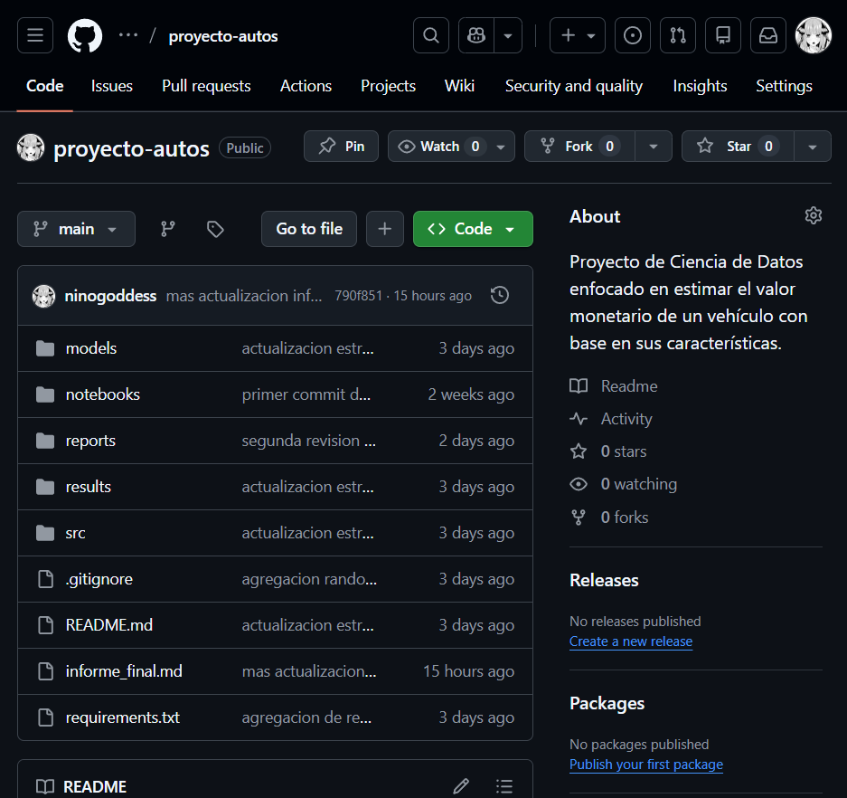

# Choque de Realidad - Informe Unificado

**Proyecto:** Sistema de estimación de precios de vehículos usados con aprendizaje automático
**Autor:** Celso Farías Araya
**Carrera:** Ingeniería Civil Informática
**Universidad:** Andrés Bello — Sede Viña del Mar
**Fecha:** 18 de Junio de 2026
**Repositorio:** https://github.com/ninogoddess/proyecto-autos

---

## Tabla de Contenidos

1. [Problemática y alcance del proyecto](#1-problemática-y-alcance-del-proyecto)
2. [Metodología y planificación](#2-metodología-y-planificación)
3. [Análisis exploratorio del dataset](#3-análisis-exploratorio-del-dataset)
4. [Técnicas candidatas para evaluación](#4-técnicas-candidatas-para-evaluación)
5. [Comparación de técnicas](#5-comparación-de-técnicas)
6. [Requisitos del proyecto](#6-requisitos-del-proyecto)
7. [Selección de la arquitectura del modelo](#7-selección-de-la-arquitectura-del-modelo)
8. [Elaboración del modelo](#8-elaboración-del-modelo)
9. [Desarrollo frontend y backend](#9-desarrollo-frontend-y-backend)
10. [Evaluación de resultados](#10-evaluación-de-resultados)
11. [Código fuente](#11-código-fuente)
12. [Conclusiones](#12-conclusiones)
13. [Referencias — Norma APA, 7.ª edición](#13-referencias--norma-apa-7ª-edición)

---

## Resumen

Este documento junta en un solo lugar todo el recorrido del proyecto: desde plantear el problema y mirar el dataset por primera vez, hasta dejar funcionando un sistema web que predice precios de verdad. En el camino se limpió un conjunto de más de 426.000 publicaciones reales, se compararon cinco técnicas de regresión, Random Forest se erigió como la ganadora, con un R² de 0,9497, y se armó una applicacíon web completa: con un backend en FastAPI que sirve el modelo y un frontend en React que consume las predicciones.

La idea es que, leyendo solo este informe, se comprenda el proyecto de principio a fin sin tener que saltar entre los demás reportes, y, por supuesto, se pueden revisar para más detallados.

---

## 1. Problemática y alcance del proyecto

### 1.1 El problema

Ponerle precio a un auto usado es más difícil de lo que parece. Tanto para una automotora como para alguien que quiere vender su vehículo, la tasación suele depender del ojo del que sabe, de la experiencia o de herramientas bastante limitadas. El resultado es siempre el mismo: inconsistencias, autos sobrevalorados y otros regalados. El comprador no tiene una referencia clara para negociar y el vendedor tampoco sabe bien cuánto pedir.

Y la cosa se complica porque el precio de un auto no depende de una sola variable. Es el resultado de un montón de factores actuando juntos, como el año, marca, modelo, kilometraje, combustible, transmisión, estado, ubicación, que además se combinan de forma nada lineal. A eso súmale que el mercado se mueve: inflación, tipo de cambio, oferta y demanda. Un auto puede "cambiar de precio" sin que le toques una sola característica.

### 1.2 La pregunta

> **¿Hasta qué punto se puede estimar el precio de un auto usado a partir de sus características, como año, marca, modelo, kilometraje y tipo de combustible?**

### 1.3 Por qué vale la pena, y qué dice la literatura reciente

No soy el primero ni el último en meterle ciencia de datos a este problema, y eso es bueno: hay harto trabajo reciente que respalda el enfoque. La literatura al menos los últimos cinco años coincide en varias cosas, y conviene apoyarse en ella.

Lo primero, que predecir precios de autos es un área de interés justamente porque requiere conocimiento del rubro y mirar muchos atributos a la vez; automatizarlo con datos tiene sentido. Lo segundo, y esto es clave, casi todos los estudios comparativos terminan apuntando a lo mismo: los modelos de ensamble basados en árboles son los que mejor funcionan. Al-Turjman et al. (2022) trabajan la clasificación y predicción de precios en el contexto de manufactura inteligente y muestran lo que rinden los enfoques supervisados sobre datos heterogéneos. Cui et al. (2022) arman un esquema iterativo con XGBoost y LightGBM y consiguen muy buena precisión con boosting sobre datos tabulares. Y varios trabajos más recientes (AIP Conference Proceedings, 2025; World Journal of Advanced Research and Reviews, 2024) repiten el patrón: Random Forest gana, explicando alrededor del 92 % de la varianza de los precios. Incluso hay investigación que agrega un detalle interesante, como ProbSAINT, 2024: no basta con acertar el precio, también importa saber cuándo el modelo no está seguro de lo que dice.

De todo esto saco tres ideas que enmarcan el proyecto: el problema es no lineal de verdad, así que los modelos lineales sirven de punto de partida, no de meta; los ensambles de árboles, en especial Random Forest, son el estándar para esto; y la calidad de los datos pesa tanto como el algoritmo que elijas.

> *Notita: Las fuentes citadas fueron parafraseadas para respetar las restricciones de licenciamiento. Las referencias completas están en la Sección 13.*

### 1.4 Qué requisitos salen de acá

Del problema y de lo que dice la literatura caen, casi solos, estos requisitos de alto nivel; los detallo en la Sección 6:

- Un modelo que **estime el precio** con error acotado y buen R²; meta: R² ≥ 0,90.
- Una **comparación honesta** entre varias técnicas, con métricas estándar.
- Un **pipeline reproducible**, de la ingesta a la inferencia.
- Una **interfaz** donde cualquiera meta los datos del auto y reciba una estimación clara.
- **Orden y mantenibilidad**: arquitectura modular y documentación.

### 1.5 Hasta dónde llega el proyecto, y hasta dónde no

**Lo que sí abarca:** análisis exploratorio y de calidad de datos, todo el preprocesamiento, llámese limpieza, codificación y normalización, el entrenamiento y comparación de cinco técnicas, la elección y caracterización del modelo ganador, y un sistema web funcional, en backend de inferencia más frontend, que corre en local, más la documentación de todo el proceso.

**Lo que no:** esto es una herramienta de **apoyo a la tasación**, no un tasador legal ni un reemplazo del que sabe. El modelo se entrenó con datos del mercado de Estados Unidos, desde Craigslist, así que aplicarlo tal cual a Chile es una extrapolación que hay que mirar con criterio y tomar cpon pinzas. Por ahora tampoco entra el reentrenamiento automático en producción, ni variables macroeconómicas, ni procesar las descripciones de los anuncios con NLP. Eso queda anotado como trabajo futuro.

---
## 2. Metodología y planificación

### 2.1 El marco CRISP-DM

Trabajé con **CRISP-DM**, Cross-Industry Standard Process for Data Mining, que básicamente ordena un proyecto de datos en seis fases y deja volver atrás cuando hace falta. Lo elegí porque es iterativo y trazable, y porque permite enganchar cada tarea técnica con los objetivos reales del proyecto en lugar de avanzar a ciegas.

| Fase CRISP-DM | Qué se hizo acá | Dónde quedó |
|---------------|-----------------|-------------|
| 1. Comprensión del negocio | Definir el problema de la tasación, la pregunta, los objetivos y los KPIs | `README.md`, `primer_informe.md` |
| 2. Comprensión de los datos | EDA, estudio de completitud, outliers y correlaciones | `notebooks/01_EDA...`, `reports/01_data_guality.md` |
| 3. Preparación de los datos | Limpieza, imputación, codificación —One-Hot y Target Encoding— y normalización | `notebooks/02_preprocesamiento...`, `src/encode_dataset.py`, `reports/01.5_segundo_preprocesamiento.md` |
| 4. Modelado | Entrenar cinco técnicas de regresión, cada una por su lado | `src/<técnica>/train_*.py`, `models/<técnica>/model.pkl` |
| 5. Evaluación | Comparar con métricas estándar —MAE, RMSE, R², MAPE— y elegir | `results/`, `reports/02_comparación_técnicas.md` |
| 6. Despliegue | Armar el sistema web, FastAPI + React, y conectar el modelo de verdad | `app-mockup-autos-celso/`, `reports/03`, `04`, `05` |

### 2.2 Las fases un poco más en detalle

**Análisis exploratorio.** Acá me senté a mirar el dataset: tres niveles de completitud, outliers feos en `price`, `odometer` y `year`, y una variable, `county`, que venía 100 % vacía. Salieron gráficos de distribuciones, relaciones entre variables y la matriz de correlación; todo en la Sección 3.

**Selección de técnicas.** Partí con siete candidatas de la literatura y me quedé con cinco para implementar, buscando equilibrio entre interpretabilidad, complejidad y costo de cómputo. Para más detalle, véase la Sección 4.

**Diseño de la arquitectura.** Pensé el proyecto en dos planos: el de modelado, como notebooks más scripts en `src/`, con los modelos en `models/` y las métricas en `results/`; y el de servicio, backend FastAPI separado en `routers`, `services`, `schemas`, `utils`; frontend React con `components`, `hooks`, `services`.

**Implementación.** Cada técnica quedó en un script independiente que entrena, mide, guarda el modelo y registra las métricas. Después vino la app que usa al ganador en inferencia.

**Validación y evaluación.** Partición entrenamiento/prueba 80/20 con `random_state=42`, evaluando sobre datos que el modelo nunca vio. Quedó Random Forest; Secciones 8 y 10.

### 2.3 El plan de trabajo

El proyecto lo hice yo solo, **Celso Farías**, poniéndome todos los sombreros xd: analista de datos, ingeniero de ML y desarrollador full-stack. El sendero no fue distante, fue temporal; extendiéndose aproximadamente unos tres meses, tratando de que cada tarea apuntara a un objetivo o requisito concreto.

| # | Tarea | Responsable | Plazo | Objetivo/Requisito |
|---|-------|-------------|-------|--------------------|
| 1 | Comprensión del negocio: problema, pregunta, objetivos y KPIs | Celso Farías | Semana del 30 de marzo | Alcance, Sec. 1 |
| 2 | Análisis exploratorio de datos, EDA | Celso Farías | Semana del 6 de abril | Objetivo 2 / calidad de datos |
| 3 | Preprocesamiento inicial: limpieza, imputación, Min-Max | Celso Farías | Semana del 13 de abril | Objetivo 1 |
| 4 | Codificación final: One-Hot + Target Encoding + StandardScaler | Celso Farías | Semana del 28 de abril | Objetivo 1 / entrenamiento |
| 5 | Entrenar y comparar cinco técnicas | Celso Farías | Semanas del 20 y 29 de abril | Objetivo 3 / métricas |
| 6 | Elegir y caracterizar el modelo ganador | Celso Farías | Inicios de mayo | Objetivo 3 |
| 7 | Backend de inferencia, FastAPI | Celso Farías | Mayo | Objetivo 4 / req. 3 y 5 |
| 8 | Recuperar artefactos del pipeline: scaler, encoding, modelos por marca | Celso Farías | 31 de mayo | Consistencia entrenamiento-inferencia |
| 9 | Frontend funcional e integración con el backend | Celso Farías | Junio | Objetivo 4 / req. 2, 4 y 6 |
| 10 | Despliegue local, pruebas y documentación | Celso Farías | 04 de junio | Req. no funcionales / docs |

No fue una línea recta, eso sí. Lo bueno de CRISP-DM es justamente que te deja devolverte: cuando llegué a la fase de inferencia me di cuenta de que no había guardado los parámetros del `StandardScaler` durante el entrenamiento, así que tuve que volver y recuperarlos, la tarea 8. Cosas que pasan, pasas que cosan. La vida es recuperable, el tiempo no.

---
## 3. Análisis exploratorio del dataset

### 3.1 De qué dataset hablamos

Usé el **Craigslist Cars and Trucks Data**, Reese, 2021, obtenido desde de Kaggle. Son publicaciones reales de autos en venta en distintas regiones de Estados Unidos. Inicialmente trae:

- **426.880 registros**
- **26 variables**

La variable objetivo es `price`. El resto mezcla numéricas, categóricas y un montón de metadata que no sirve para predecir:

| Tipo | Variables | Para qué |
|------|-----------|----------|
| Numéricas | `price`, `year`, `odometer`, `lat`, `long` | Objetivo y predictoras continuas |
| Categóricas | `manufacturer`, `model`, `fuel`, `transmission`, `condition`, `type`, `cylinders`, `title_status`, `drive`, `paint_color`, `size`, `state`, `region` | Predictoras descriptivas |
| Identificación / metadata | `id`, `url`, `region_url`, `image_url`, `description`, `VIN`, `county`, `posting_date` | Sin valor predictivo directo |

La relación con el problema es directa: tengo el precio, lo que quiero predecir, y un buen puñado de variables que lo explican. Justo lo que se necesita.

### 3.2 Completitud: quién viene completo y quién no

Hay tres grupos bien marcados:

- **Casi completas:** `price`, `region`, `state` | ≈ 0 % de nulos.
- **Pocos nulos (< 5 %):** `year`, `manufacturer`, `model`, `odometer`, `fuel`, `transmission`.
- **Muchos nulos:** `condition` ≈ 40,7 % |`cylinders` ≈ 41,6 % | `VIN` ≈ 37,7 % | `drive` y `paint_color` ≈ 30,5 % | `size` ≈ 71,7 %.

Y el caso extremo: `county` viene con **100 % de nulos**. No aporta absolutamente nada, así FUERA iii.

### 3.3 Correctitud y consistencia: el lado feo de los datos reales

Como son publicaciones que escribió gente real, sin control de calidad, aparecen cosas raras:

- **Precios** en cero o absurdamente altos; vi un máximo de 3.736.928.711, que obviamente no es un auto, o quizás uno demasiado costoso como para los simples mortales...
- **Kilometrajes** poco creíbles, con máximos cerca de 10.000.000.
- **Años** fuera de rango, con mínimos de 1900.
- **Coordenadas** `lat`, `long` con valores extremos que huelen a error de registro.

### 3.4 Estadística descriptiva y outliers

La variable objetivo viene bien sesgada, y se nota al toque en la diferencia entre media y mediana:

| Estadístico (`price`) | Valor |
|-----------------------|-------|
| Promedio | 75.199 |
| Mediana | 13.950 |
| Máximo | 3.736.928.711 |

Esa brecha tan grande dice dos cosas: que la mediana representa mucho mejor el comportamiento real, y que los valores extremos son outliers que están deformando la escala. Lo mismo pasa con `odometer`, kilometrajes irreales, y `year`, años imposibles.

### 3.5 Las visualizaciones

**Distribución de precios, data original.**


La mayoría de los precios está entre 5.000 y 20.000 USD; los extremos arruinan la escala.

**Boxplot de precios.**


Casi todo cabe en un rango acotado, y lo que se sale son los outliers que hay que tratar.

**Precio vs. Año.**


Los autos más nuevos tienden a costar más, salvo excepciones: esos clásicos de los 50 y los 70, verdaderas joyitas del mundo automotriz que rompen la regla.

**Precio vs. Odómetro.**


Mientras más kilómetros, menos valor. La depreciación por uso se ve clarísima.

**Fabricantes más frecuentes.**


Dominan Ford, Chevrolet y Toyota, los pesos pesados del dataset.

**Matriz de correlación.**


Acá viene lo interesante: ninguna variable sola explica bien el precio. Eso no es un problema, es una pista. El precio sale de la interacción de varias cosas a la vez, y ya nos anticipa que vamos a necesitar modelos no lineales.

### 3.6 Lo que saqué

- `model` tiene cardinalidad altísima (miles de valores únicos); en cambio `transmission`, `fuel` y `condition` tienen pocas categorías.
- Variables como `id`, `url`, `image_url`, `description` y `VIN` no aportan nada al precio.
- Se confirman las relaciones esperables: sube con el año, baja con el kilometraje, y las marcas grandes copan los registros.
- El problema es no lineal y multifactorial, así que la estrategia apunta a ensambles de árboles.

### 3.7 EDA sobre la data ya procesada

Después del preprocesamiento revisé que las distribuciones siguieran teniendo sentido, ahora en escala normalizada. Y sí: las relaciones se mantienen, solo cambia la forma en que se ven. O sea, las transformaciones no rompieron nada.


> El EDA completo está en `notebooks/01_EDA_primer_avance_CD_autos.ipynb` y en `reports/01_data_guality.md`.

---
## 4. Técnicas candidatas para evaluación

### 4.1 El casting inicial

Mirando la literatura junté siete candidatas: Regresión Lineal, Ridge o L2, Lasso o L1, Elastic Net, Random Forest, Gradient Boosting y Support Vector Regression, SVR. Cada una ve el mundo a su manera y tiene su forma de aprender la relación entre las variables y el precio.

### 4.2 Las cinco que quedaron, y por qué

De las siete me quedé con **cinco** para implementar. Dejé fuera a Elastic Net, por redundancia conceptual respecto a Ridge y Lasso, y a SVR, porque su costo computacional sobre un dataset tan grande no se justifica; no vamos a matar una mosca con una bazooka. El criterio fue equilibrar interpretabilidad, complejidad y capacidad de modelado.

| Técnica | Qué modela | Lo bueno | Lo no tan bueno |
|---------|-----------|----------|-----------------|
| Regresión Lineal | Relación lineal por mínimos cuadrados | Simple, interpretable, buen baseline | No capta lo no lineal; sensible a outliers |
| Ridge (L2) | Lineal con penalización L2 | Reduce sobreajuste, estabiliza coeficientes | No selecciona variables |
| Lasso (L1) | Lineal con penalización L1 | Selecciona variables solo, más interpretable | Inestable con variables correlacionadas |
| Random Forest | Ensamble de árboles (bagging) | Capta no linealidad, robusto al ruido, preciso | Pesado, menos interpretable |
| Gradient Boosting | Ensamble secuencial que corrige errores | Mucha precisión potencial, compacto | Sensible a hiperparámetros, más lento |

### 4.3 En qué me apoyo: los trabajos previos

La elección no salió de la nada; hay harto trabajo que respalda usar estas técnicas:

- **Los lineales como punto de partida.** La literatura clásica del aprendizaje estadístico —James et al., 2021; Tibshirani, 1996; Hoerl & Kennard, 1970— deja la regresión lineal y sus versiones regularizadas, Ridge y Lasso, como el baseline obligado de cualquier problema de regresión, por interpretables y por ser un buen piso contra el cual comparar.
- **Los ensambles de árboles ganan.** Breiman, 2001, presenta Random Forest y muestra por qué es robusto: bagging + aleatorización de variables. Y los estudios recientes lo confirman justo en este dominio: AIP Conference Proceedings, 2025; World Journal of Advanced Research and Reviews, 2024; y Al-Turjman et al., 2022, repiten que Random Forest rinde mejor, explicando cerca del 92 % de la varianza de los precios.
- **El boosting también pelea.** Friedman, 2001, formaliza el Gradient Boosting, y Cui et al., 2022, muestran que esquemas de boosting como XGBoost + LightGBM son muy competitivos prediciendo precios de autos usados. Razón suficiente para meterlo en la comparación.
- **Saber cuándo el modelo duda.** La línea de regresión tabular probabilística, como ProbSAINT, 2024, refuerza que comparar varias técnicas vale la pena, no solo por el error sino por la confiabilidad.

En resumen: una comparación que incluye un baseline lineal, sus regularizaciones y dos familias de ensambles, bagging y boosting, es la forma de poner a prueba, en serio, la hipótesis de que el problema es no lineal.

> *Las fuentes fueron parafraseadas para cumplir con las restricciones de licenciamiento. Ver Sección 13.*

---
## 5. Comparación de técnicas

### 5.1 Cómo monté el experimento

Las cinco técnicas se entrenaron sobre el **mismo dataset procesado**: 349.623 registros, 92 columnas tras la codificación. Esto es importante: si todas parten de los mismos datos, la comparación es justa y las diferencias son del algoritmo, no de los datos. Cada técnica vive en su propio script en `src/<técnica>/train_*.py`: entrena, calcula métricas, las guarda en `results/` y serializa el modelo en `models/`. La partición fue 80/20 con `random_state=42`.

**Hardware usado:** CPU AMD Ryzen 7 4800H, 16 GB de RAM, GPU RTX 2060, en Windows 10 con VS Code.

### 5.2 Las métricas que usé

Como esto es **regresión**, las métricas son las que corresponden a una variable continua, y responden directo a lo que pide el proyecto; precisión y consistencia:

- **MAE** o Error Absoluto Medio: el error promedio, en la escala de la variable.
- **RMSE** o Raíz del Error Cuadrático Medio: castiga más fuerte los errores grandes.
- **R²** o Coeficiente de Determinación: cuánta varianza explica el modelo.
- **MAPE** o Error Porcentual Absoluto Medio: el error relativo, en porcentaje.
- **Tiempo de entrenamiento** [s]: como proxy de la eficiencia.

> Notita : precisión, recall, F1 y AUC son métricas de clasificación, así que acá no aplican. Su equivalente para regresión lo veo en la Sección 10.

### 5.3 Los resultados

Sobre el conjunto de prueba; en escala normalizada, sacados de `results/metrics_global.csv`:

| Modelo | MAE | RMSE | R² | MAPE (%) | Tiempo (s) | Tamaño |
|--------|-----|------|----|----------|-----------|--------|
| Regresión Lineal | 0,2892 | 0,4333 | 0,8130 | 115,96 | 1,70 | ~4 KB |
| Ridge | 0,2892 | 0,4333 | 0,8130 | 115,96 | 0,43 | ~4 KB |
| Lasso | 0,2914 | 0,4381 | 0,8089 | 116,98 | 1,50 | ~4 KB |
| Gradient Boosting | 0,2412 | 0,3795 | 0,8566 | 120,58 | 73,54 | ~142 KB |
| **Random Forest** | **0,1017** | **0,2247** | **0,9497** | **52,14** | 66,32 | ~1,5 GB |

*En negrita, el mejor valor de cada métrica.*

### 5.4 Qué pasó, leído con calma

**Los lineales: Lineal, Ridge, Lasso.** Llegaron a un R² cercano a 0,81. Eso alcanza para entender la superficie del problema, pero no para llegar al fondo. Lineal y Ridge dieron resultados idénticos, lo que dice algo lindo: no había inestabilidad numérica que la regularización tuviera que arreglar, el modelo ya estaba en equilibrio desde su forma más simple. Lasso, por su parte, eliminó cerca del 45 % de las variables sin perder casi nada de rendimiento, lo que sugiere que había bastante redundancia dando vueltas.

**Gradient Boosting.** Mejoró respecto a los lineales con un R² = 0,8566, más se quedó a medio camino. Con árboles poco profundos, su enfoque secuencial no logró alcanzar lo que el bagging consiguió en este dataset.

**Random Forest.** Acá está el salto. Bajó el MAE a 0,1017; menos de la mitad que los lineales, el RMSE a 0,2247 y subió el R² a 0,9497, además de cortar el MAPE a la mitad. La realidad no se dejó encerrar en una línea; hizo falta un bosque entero para entenderla.

### 5.5 No solo de precisión vive el modelo

La comparación también mira dos cosas que suelen olvidarse:

- **Calidad de los datos.** Como todos partieron del mismo dataset limpio, las diferencias son del algoritmo. Y un punto a favor de Random Forest es que aguanta bien el ruido que quedó; esos outliers de alto kilometraje que decidí conservar.
- **Costo computacional.** Acá el contraste es brutal: los lineales pesan ~4 KB y entrenan en segundos, mientras que Random Forest ocupa ~1,5 GB y se demora ~66 s. Esto no es un detalle menor a la hora de desplegar, considerando memoria y tiempo de carga, así que lo retomo en las Secciones 7 y 9.

### 5.6 El ganador

Obviamente **Random Forest**, priorizando el desempeño en métricas. Asumo a conciencia que es ridículamente pesado comparado con el resto, pero el salto de calidad que da no lo iguala ninguno. Y eso, para este proyecto, manda.

> El detalle completo está en `reports/02_comparación_técnicas.md`.

---
## 6. Requisitos del proyecto

Los requisitos salen de los objetivos y del alcance, recordemos la Sección 1, y cada uno está enganchado a algo concreto. Si se cumplieron o no, lo reviso en la Sección 10.

### 6.1 Requisitos funcionales

| ID | Requisito | Para qué |
|----|-----------|----------|
| RF-1 | Entrenar varios modelos para poder compararlos | Objetivo 3 |
| RF-2 | Generar métricas claras y automáticas tras cada entrenamiento (nada a mano) | Comparación objetiva |
| RF-3 | Guardar de forma ordenada datos procesados y modelos (`.pkl`) | Pipeline reproducible |
| RF-4 | Endpoint `POST /api/v1/predict` que reciba las características y devuelva el precio en USD y CLP | Interfaz de estimación |
| RF-5 | Endpoint `GET /api/v1/options` que dé las opciones válidas del formulario desde el dataset | Usabilidad del formulario |
| RF-6 | Endpoint `GET /api/v1/health` para ver el estado del servicio y si el modelo está cargado | Monitoreabilidad |
| RF-7 | Formulario que capture marca, modelo, año, kilometraje, combustible, transmisión y tipo, filtrando modelos por marca | Interfaz intuitiva |
| RF-8 | Replicar en inferencia el mismo pipeline del entrenamiento (Min-Max, Target Encoding, One-Hot, StandardScaler) y desnormalizar el resultado | Confiabilidad de la predicción |

### 6.2 Requisitos no funcionales

| ID | Atributo | Requisito | Para qué |
|----|----------|-----------|----------|
| RNF-1 | **Usabilidad** | Interfaz responsiva (≥ 320 px), sin scroll horizontal, validación inmediata y errores por campo | Objetivo 4 |
| RNF-2 | **Explicabilidad** | Tener la importancia de variables del modelo y mostrar advertencias cuando la marca o el modelo no se reconocen | Transparencia |
| RNF-3 | **Escalabilidad** | Pipeline capaz de absorber más datos; backend escalable en horizontal con varias instancias y *health check* | Mantenibilidad |
| RNF-4 | **Seguridad** | Validación en dos capas (cliente y servidor con Pydantic), CORS explícito (no comodín), secretos en `.env` fuera del repo, sin exponer trazas internas | Buenas prácticas |
| RNF-5 | **Confiabilidad** | Manejo de errores por capas (422, 503, 500), modo degradado si el modelo no carga, respuesta < 5 s | Estabilidad |
| RNF-6 | **Monitoreabilidad** | Logging con ID único por request y tiempo de respuesta; endpoint de salud | Operación y diagnóstico |
| RNF-7 | **Mantenibilidad** | Arquitectura modular (back y front), componentes acotados, ESLint sin errores | Calidad de código |
| RNF-8 | **Reproducibilidad** | Notebooks y scripts ejecutables en orden, dataset procesado versionado afuera, documentación completa | Trazabilidad |

La idea es que cada requisito esté amarrado al alcance: los funcionales aterrizan los objetivos de modelado e interfaz, y los no funcionales son los que hacen que la solución sea usable, confiable y mantenible como proyecto de ingeniería, no solo un script que anda en mi máquina.

---
## 7. Selección de la arquitectura del modelo

### 7.1 Con qué criterio elegí

La decisión del modelo final se basó en mirar el **error**; MAE, RMSE; la **varianza explicada** en R² y el **error relativo** de MAPE sobre el conjunto de prueba, comparando las cinco técnicas, recordemos la Sección 5. Random Forest ganó en todas las métricas de calidad, sin discusión, y por eso quedó como la arquitectura más adecuada.

### 7.2 La comparación que lo justifica

| Modelo | R² | RMSE | MAE | MAPE (%) | Veredicto |
|--------|----|------|-----|----------|-----------|
| Lineal / Ridge | 0,8130 | 0,4333 | 0,2892 | 115,96 | Baseline lineal |
| Lasso | 0,8089 | 0,4381 | 0,2914 | 116,98 | Baseline + selección de variables |
| Gradient Boosting | 0,8566 | 0,3795 | 0,2412 | 120,58 | Mejora intermedia |
| **Random Forest** | **0,9497** | **0,2247** | **0,1017** | **52,14** | **Elegido** |

La diferencia es grande de verdad: Random Forest le mete más de 13 puntos de R² al mejor lineal y baja el RMSE casi a la mitad.

### 7.3 Cómo es esta arquitectura, y qué son sus "parámetros"

Random Forest es un ensamble de árboles de decisión que funciona por **bagging**: entrena muchos árboles sobre subconjuntos aleatorios de datos y de variables, y después promedia lo que dicen todos. A diferencia de un modelo lineal o de una red neuronal, **no aprende coeficientes ni pesos por capa**. Lo que aprende son reglas: cada nodo de cada árbol es un umbral sobre una variable. Si se intenta traducir o forzar a la jerga de "capas, neuronas y entradas/salidas" de una red, queda más o menos así:

- **Entradas:** un vector de **91 características**, después de codificar el dataset, entre numéricas normalizadas, como `year`, `odometer`, `cylinders`, `lat`, `long`, `model_encoded` y las columnas one-hot de las categóricas.
- **Unidad de cómputo:** el árbol de decisión; cada nodo interno hace de "neurona" que parte el espacio según un umbral.
- **Profundidad:** el equivalente a las "capas"; acá el bosque llegó a profundidades de entre 47 y 59 niveles.
- **Salida:** un número continuo: el precio en escala normalizada, que sale de promediar los 100 árboles.

### 7.4 Hiperparámetros

Definidos en `src/random_forest/train_random_forest.py`:

| Hiperparámetro | Valor | Por qué |
|----------------|-------|---------|
| `n_estimators` | 100 | Cantidad de árboles; equilibra estabilidad y costo |
| `max_depth` | `None` | Crecimiento libre hasta hojas puras, para capturar las relaciones locales más finas |
| `random_state` | 42 | Reproducibilidad |
| `n_jobs` | -1 | Usar todos los núcleos disponibles |

### 7.5 Cómo quedó el modelo por dentro

Cuando miré la complejidad del modelo entrenado (`results/random_forest/model_complexity.md`), el tamaño de lo que aprendió impresiona:

| Métrica de complejidad | Valor |
|------------------------|-------|
| Número de árboles | 100 |
| Total de nodos | 22.134.188 |
| Nodos promedio por árbol | 221.341,88 |
| Profundidad promedio | 50,53 |
| Profundidad máxima | 59 |
| Profundidad mínima | 47 |

Más de 22 millones de nodos de decisión. Eso explica las dos caras del modelo: su gran capacidad para predecir y, al mismo tiempo, su peso de ~1,5 GB. Dejar crecer los árboles sin podar usando `max_depth=None` se justifica porque la depreciación de un auto no es constante: un clásico del 60 puede valer más que un sedán común del 2010, y esas excepciones son invisibles para un modelo lineal. El riesgo de sobreajuste lo controla la propia aleatorización del bagging, que mantiene el R² alto sobre datos que el modelo no vio, explicado en Sección 10, falta poquito.

### 7.6 Sobre la convergencia

A diferencia de los modelos que entrenan por épocas con gradiente, Random Forest no tiene una curva de convergencia clásica. Su "convergencia" se entiende como la **estabilización del error a medida que sumas árboles**. Con `n_estimators=100` el desempeño ya se asentó con R² = 0,9497, sin señales de empeorar sobre el conjunto de prueba, así que 100 árboles fue un número adecuado para este dataset.

---
## 8. Elaboración del modelo

### 8.1 Dejar el dataset listo

Antes de entrenar, el dataset pasó por todo un pipeline de transformación, debidamente documentado en `reports/01.5_segundo_preprocesamiento.md` y en `src/encode_dataset.py`:

1. Sacar las columnas irrelevantes y también `state`, correspondiente a ruido geográfico que no aplica al contexto donde se usaría.
2. **Target Encoding** de `model`: cada modelo se reemplazó por su precio promedio histórico. Así condensé una variable de cardinalidad altísima en una sola dimensión continua, sin explosión de columnas. El mapeo quedó guardado en `model_encoding_map.csv` para usarlo igual en inferencia.
3. Pasar `cylinders` de texto (`"8 cylinders"`) a número (`8`), porque eso es una magnitud, no una categoría.
4. **One-Hot Encoding** con `drop_first=True` para `title_status`, `drive`, `paint_color` y las demás categóricas de baja/media cardinalidad, evitando multicolinealidad.
5. Rellenar los nulos que quedaban con 0.
6. **Normalizar**: Min-Max sobre `price`, `year` y `odometer` con rango [0,1] y, después, `StandardScaler` sobre las numéricas no binarias.

El dataset final quedó **100 % numérico, sin nulos**, con 349.623 registros y 92 columnas.

### 8.2 La partición entrenamiento/validación

Usé la división clásica **80/20**: 80 % para entrenar, construyendo los árboles, y un 20 % reservado a rajatabla para validar cómo generaliza frente a datos nuevos. El muestreo fue aleatorio con `random_state=42`, para que sea reproducible. La misma partición se usó en las cinco técnicas, así la comparación es pareja.

### 8.3 Cómo se distribuyen los datos

La variable objetivo sigue sesgada incluso después de filtrar, debido a los precios concentrados en rangos moderados con una cola hacia arriba. La normalización Min-Max comprimió la mayoría de los valores en un rango chico y estiró la cola dentro del nuevo intervalo, sin alterar las relaciones de fondo. Como el muestreo es aleatorio sobre un volumen grande, ≈ 350 mil registros, asumí que train y test son representativos del dominio.

### 8.4 El tema del balanceo de clases

Acá hay que ser honesto. El balanceo de clases es algo de los problemas de **clasificación**, donde tener categorías desparejas puede sesgar el aprendizaje. **Este problema es de regresión**, `price` es continuo, así que el balanceo de clases no aplica directo: no hay "clases" que emparejar.

Lo que sí tiene sentido en regresión es lidiar con la **distribución sesgada del objetivo y con las categóricas desbalanceadas**, como el predominio de Ford, Chevrolet y Toyota, o la mayoría de transmisiones automáticas. Frente a eso, lo que hice cumple ese mismo rol de mitigar el efecto del desbalance/sesgo:

1. **Filtré rangos coherentes**; precio > 0; odómetro en [0, 300.000]; año en [1980, 2024]: así corté la cola de outliers que deformaba la distribución, sin matar la variabilidad legítima.
2. **Normalicé y estandaricé** las numéricas: emparejo escalas y evito que las variables más "grandes" dominen el aprendizaje.
3. **Decidí, a propósito, no rebalancear las categorías**; `manufacturer`, `transmission`: siendo un problema de regresión, el modelo aprende relaciones continuas sin que lo afecte tanto la frecuencia relativa de cada categoría. Forzar un balanceo ahí metería más distorsión que beneficio. Y los registros de alto kilometraje los conservé porque le enseñan algo útil al modelo.

¿El efecto? Bueno: las distribuciones procesadas mantuvieron sus patrones, como mencioné en la Sección 3.7, y el modelo llegó a un R² de 0,9497 sobre datos no vistos, sin señales de que el predominio de las marcas grandes le haya bajado el rendimiento general.

---
## 9. Desarrollo frontend y backend

### 9.1 La arquitectura, en general

El sistema (Hito 2) son dos componentes independientes que se hablan por HTTP REST, sin compartir base de datos ni estado en memoria:

```
┌─────────────────────┐       ┌──────────────────────────┐
│   Frontend (React)  │  HTTP │   Backend (FastAPI)      │
│   localhost:5173    │──────►│   localhost:8000         │
│   - Formulario      │◄──────│   - /api/v1/predict      │
│   - Validación      │  JSON │   - /api/v1/options      │
│   - Resultados      │       │   - /api/v1/health       │
└─────────────────────┘       └──────────┬───────────────┘
                                         │
                          ┌──────────────▼───────────────┐
                          │   Artefactos ML (en disco)    │
                          │   model.pkl (~1.5 GB)         │
                          │   model_encoding_map.csv      │
                          │   scaler_params.json          │
                          │   models_by_manufacturer.json │
                          └───────────────────────────────┘
```

> Una de las grandes mejoras del Hito 2 fue reemplazar el mockup no funcional del Hito 1 por un sistema que funciona de verdad. La predicción dejó de ser de mentira: cada solicitud pasa por el pipeline completo de validación, preprocesamiento, inferencia y desnormalización.

### 9.2 El backend en FastAPI

Hecho con FastAPI y Uvicorn, con documentación automática vía OpenAPI/Swagger en `/docs`. Sigue una arquitectura modular con responsabilidades bien separadas:

- `routers/`: solo manejan HTTP, nada de lógica de negocio.
- `services/`: la lógica de predicción y preprocesamiento.
- `schemas/`: los contratos de datos con Pydantic.
- `config/`: configuración centralizada con dotenv.
- `utils/`: el cargador de artefactos ML.

**Los endpoints:**

| Endpoint | Método | Qué hace |
|----------|--------|----------|
| `/api/v1/health` | GET | Revisa el estado del servicio y si el modelo está cargado |
| `/api/v1/options` | GET | Entrega marcas, modelos por marca, combustibles, transmisiones y tipos |
| `/api/v1/predict` | POST | Recibe las características del auto y devuelve el precio en USD y CLP |

El modelo de ~1,5 GB se carga **una sola vez al arrancar** el servidor, con el evento `lifespan`, así cada predicción tarda < 1 s en lugar de los ~30 s que cuesta cargarlo.

**El pipeline de inferencia** repite lo del entrenamiento: Min-Max sobre `year` y `odometer` → Target Encoding de `model` → One-Hot de las categóricas → armar el vector de 91 características → inferencia → desnormalizar al revés, con StandardScaler⁻¹ → Min-Max⁻¹ → USD → CLP.

### 9.3 El frontend en React + Vite

La interfaz está hecha con React 19 y Vite, conectada al backend con Axios a través de una capa de servicio centralizada, `predictionService.js`; los componentes nunca llaman directo a la API. El flujo carga las opciones al inicio, filtra los modelos según la marca que elijas, detecta solo el tipo de vehículo, valida en el cliente y muestra el resultado con una animación.

### 9.4 Usabilidad y escalabilidad

- **Usabilidad (RNF-1):** diseño responsivo (≥ 320 px), sin scroll horizontal, validación al toque con mensajes por campo, estados de carga con mensajes que rotan, y respeto por `prefers-reduced-motion`.
- **Escalabilidad (RNF-3):** componentes que se despliegan por separado, backend que escala en horizontal con varias instancias, y *health check* para balanceadores.

### 9.5 Explicabilidad y monitoreo

- **Explicabilidad (RNF-2):** el sistema muestra **advertencias** cuando la marca o el modelo no le suenan al modelo, avisando que ahí la predicción es menos precisa, y se apoya en la importancia de variables, Sección 10.3, para entender qué pesa en cada predicción.
- **Monitoreo (RNF-6):** el backend registra cada request con un **ID único** y su **tiempo de respuesta**, sin guardar datos del usuario por privacidad. Y con `/health` siempre puedo chequear que el modelo esté cargado.

```
2026-06-04 12:30:15 | INFO | → [a3f1bc20] POST /api/v1/predict
2026-06-04 12:30:15 | INFO | ← [a3f1bc20] 200 (342.5ms)
```

### 9.6 Que funciona, acá está la prueba

**Predicción exitosa en la interfaz:**


**Formulario completo antes de enviar:**


**Documentación interactiva, Swagger UI:**


**Predicción exitosa en Swagger:**


**Validación de datos inválidos, HTTP 422:**


**Health check:**


**Logs del backend:**


### 9.7 Tiempos medidos

| Operación | Tiempo | Comentario |
|-----------|--------|------------|
| Arranque del servidor (cargar modelo) | ~20-30 s | Solo al inicio |
| `GET /api/v1/health` | < 10 ms | No hace nada pesado |
| `GET /api/v1/options` | < 50 ms | Datos en memoria |
| `POST /api/v1/predict` | 100-400 ms | Preprocesamiento + inferencia |

> Las instrucciones completas para levantarlo están en `reports/04_instrucciones_levantamiento.md`, y el informe de despliegue en `reports/05_informe_despliegue.md`.

---
## 10. Evaluación de resultados, al fin

### 10.1 Cómo rindió sobre datos que nunca vio

El modelo ganador se evaluó sobre el **20 % del dataset reservado**, datos que no se usaron para entrenar. Así la medición es honesta. Y los números hablan solos:

| Métrica | Valor | Qué significa |
|---------|-------|---------------|
| MAE | 0,1017 | Error absoluto medio bajo, en escala normalizada |
| RMSE | 0,2247 | Castiga moderadamente los errores grandes |
| R² | 0,9497 | El modelo explica ≈ 95 % de la varianza del precio |
| MAPE (%) | 52,14 | Error relativo, inflado por los precios bajos en el denominador |

El R² de 0,9497 **cumple y supera la meta** que me había puesto (R² ≥ 0,90). La distancia entre MAE y RMSE dice que hay algunos errores grandes en casos extremos, lo cual es esperable por la cola de la distribución de precios.

### 10.2 Por qué no hay precision, recall ni AUC ¿?

La precisión, recall, F1-score y AUC son harina de otro costal. **Esas son métricas de clasificación y no aplican a este proyecto**, que es de regresión con un objetivo continuo. Las que corresponden para medir el ajuste de un regresor son MAE, RMSE, R² y MAPE, que ya reporté arriba. Lo dejo dicho explícito para que quede claro que no es un olvido, sino que así es.

### 10.3 Interpretabilidad: ¿qué mira el modelo?

Para abrir un poco la caja negra usé la **importancia de variables** del Random Forest (`results/random_forest/feature_importance_top20.csv`), que mide cuánto aporta cada característica a las decisiones del bosque:

| # | Variable | Importancia | Lectura |
|---|----------|-------------|---------|
| 1 | `model_encoded` | 0,6029 | El modelo/versión se lleva ≈ 60 % del peso |
| 2 | `year` | 0,2142 | La antigüedad explica ≈ 21 % |
| 3 | `odometer` | 0,0537 | El kilometraje aporta ≈ 5 %, en un plano secundario |
| 4 | `long` | 0,0165 | Componente geográfica |
| 5 | `lat` | 0,0143 | Componente geográfica |
| 6 | `cylinders` | 0,0136 | Cilindrada |
| 7 | `fuel_gas` | 0,0124 | Tipo de combustible |
| 8 | `condition_good` | 0,0097 | Estado del vehículo |

Las tres de arriba `model_encoded`, `year`, `odometer` mandan más del 85 % de la decisión; el resto es ajuste fino. Y tiene todo el sentido del mundo: el modelo específico, que ya trae el precio promedio histórico metido vía Target Encoding, y la antigüedad son los que mueven la aguja. Curioso que el kilometraje quede tan atrás, pero frente al año y al modelo, pasa a segundo plano.

**Sobre SHAP:** la rúbrica sugiere usar técnicas como SHAP. En esta versión resolví la interpretabilidad con la importancia de variables por impureza, que es nativa de Random Forest y alcanza para identificar los factores que dominan. Sumar **SHAP** sería el siguiente paso lógico, daría explicaciones por predicción individual y la dirección del efecto de cada variable, y lo dejo anotado como mejora futura. No lo pongo como hecho porque no lo hice, y prefiero no inventar resultados.

### 10.4 ¿Se cumplieron los requisitos? Mirada crítica

| Requisito | Estado | Evidencia |
|-----------|--------|-----------|
| RF-1, RF-2, RF-3 (entrenar, medir, guardar) | Cumplido | 5 modelos en `models/`, métricas en `results/` |
| RF-4..RF-8 (API e inferencia real) | Cumplido | Endpoints andando, pipeline replicado, respuesta en USD/CLP |
| RNF-1 Usabilidad | Cumplido | Interfaz responsiva, validación y estados de carga |
| RNF-2 Explicabilidad | Parcial | Importancia de variables + advertencias; falta SHAP |
| RNF-3 Escalabilidad | Cumplido, con asterisco | Escala en horizontal, pero el peso del modelo, 1,5 GB, limita el despliegue en servicios gratuitos |
| RNF-4 Seguridad | Cumplido | Validación en dos capas, CORS explícito, `.env` fuera del repo |
| RNF-5 Confiabilidad | Cumplido | Errores manejados por capas, modo degradado, < 5 s |
| RNF-6 Monitoreabilidad | Cumplido | Logging con ID y tiempo, `/health` |
| Meta R² ≥ 0,90 | Cumplido | R² = 0,9497 |

**Lo que hay que tener presente.** El modelo se entrenó con datos de Estados Unidos, así que aplicarlo a Chile es estirar la cuerda. El MAPE alto, 52,14 %, viene de que el error relativo se dispara en autos baratos. Y el peso del modelo, ~1,5 GB, condiciona el despliegue, lo que me llevó a la estrategia de correrlo en local con un túnel seguro, Cloudflare Tunnel, que está documentada en la guía de despliegue.
Así que... los obejetivos han sido cumplidos, y, respondiendo a la pregunta que lo inició todo... es posible determinar el precio de un vehiculo en una medida de aproximadamente el 95%.

---
## 11. Código fuente

### 11.1 El repositorio

Todo el código del proyecto, ordenado y documentado, está acá:

> **https://github.com/ninogoddess/proyecto-autos**

En el repo está tanto la parte de ciencia de datos; notebooks, scripts de entrenamiento, modelos y resultados; como el sistema web completo; backend FastAPI anidado y frontend React.

### 11.2 Cómo está organizado

```
proyecto-autos/
├── app-mockup-autos-celso/         ← Sistema web completo (Hito 2)
│   ├── src/                        ← Frontend React
│   │   ├── components/             ← Componentes de interfaz
│   │   ├── hooks/                  ← Lógica de estado (useVehicleForm)
│   │   ├── services/               ← Comunicación HTTP (Axios)
│   │   └── constants/              ← Traducciones y constantes
│   ├── backend/                    ← API FastAPI
│   │   ├── app/
│   │   │   ├── config/             ← Configuración centralizada
│   │   │   ├── routers/            ← Endpoints HTTP
│   │   │   ├── services/           ← Predicción y preprocesamiento
│   │   │   ├── schemas/            ← Modelos Pydantic
│   │   │   ├── utils/              ← Cargador de modelo
│   │   │   └── artifacts/          ← Artefactos ML (JSON)
│   │   └── scripts/                ← Generación de artefactos
│   ├── public/                     ← Assets estáticos
│   └── docs/                       ← Documentación técnica del sistema
├── data/
│   ├── raw/                        ← Dataset original
│   └── processed/                  ← Datasets procesados
├── models/                         ← Modelos entrenados (.pkl)
├── notebooks/                      ← EDA y preprocesamiento
├── reports/                        ← Informes técnicos
├── results/                        ← Métricas de entrenamiento
├── src/                            ← Scripts de entrenamiento
└── README.md
```

### 11.3 La documentación y el README

En la raíz hay un **README** con todo lo importante: el problema, la pregunta, los objetivos, los KPIs, la descripción del dataset, la estructura del proyecto, cómo levantarlo,  tanto back como front, reproducibilidad y un índice de la documentación. En `reports/` están los informes por etapa, y en `app-mockup-autos-celso/docs/` la documentación de arquitectura y despliegue, con diagramas Mermaid.

### 11.4 Para reproducirlo, resumidamente

1. Clonar el repo e instalar dependencias (`requirements.txt` y `package.json`).
2. Correr los notebooks en orden (`notebooks/01_EDA...`, `notebooks/02_preprocesamiento...`).
3. Bajar el dataset procesado desde Kaggle (está afuera del repo por su tamaño, ~170 MB).
4. Ejecutar `src/encode_dataset.py` y luego los scripts `src/<técnica>/train_*.py`.
5. Levantar la app siguiendo `reports/04_instrucciones_levantamiento.md`.

> Notita:  El modelo Random Forest  de ~1,5 GB y el dataset procesado no van a GitHub por su peso; se enlazan desde almacenamiento externo, OneDrive y Kaggle, respectivamente.

### 11.5 Evidencia del repo




---
## 12. Conclusiones

El proyecto cumplió lo que se propuso: armar un modelo capaz de estimar el precio de autos usados a partir de sus características, y llevarlo a un sistema web que funciona. Todo el recorrido, desde un dataset ruidoso de más de 426.000 publicaciones reales hasta el modelo corriendo en producción, terminó confirmando la idea central del trabajo.

**Lo principal que quedó claro:**

- **El problema no es lineal, y punto.** Los modelos lineales llegaron a un R² de ≈ 0,81, suficiente para asomarse al problema pero incapaz de capturar su forma real. Random Forest subió el R² a 0,9497 y dejó en evidencia que la tasación de un auto sale de un montón de interacciones locales, no de una recta.
- **El modelo y el año son los que mandan.** La importancia de variables mostró que `model_encoded` ≈ 60 %, `year` ≈ 21 % y `odometer` ≈ 5 % se llevan casi toda la decisión. Coincide con lo que cualquiera que sepa de autos te diría.
- **La calidad de los datos pesó tanto como el algoritmo.** Las decisiones de limpieza, el Target Encoding de `model` y la normalización fueron tan determinantes como elegir bien el modelo.
- **Desplegar también tiene su costo.** El peso del ganador ~1,5 GB me obligó a correrlo en local con un túnel seguro, y eso muestra la tensión real entre precisión y costo de operación.

**Lo que aprendí en el camino:** guardar el modelo no basta. Hay que guardar todo lo que necesita para hablar con el mundo: parámetros del scaler, mapeos de encoding, orden de columnas. Lo aprendí a la mala, cuando tuve que recuperar los parámetros del `StandardScaler` para que la inferencia diera bien. Lección anotada para los próximos proyectos.

**Dónde sirve esto, con ejemplos concretos:** es una herramienta de apoyo a la tasación. Una automotora podría usarla para poner un precio de referencia al recibir un auto en parte de pago; una plataforma de compraventa podría sugerirle un rango al usuario que va a publicar; y un comprador podría comparar lo que le piden por un Toyota Camry 2018 con 45.000 millas contra lo que dice el modelo, antes de sentarse a negociar. En todos los casos el valor es el mismo: tener una referencia objetiva y consistente sobre la cual decidir.

**Qué falta, trabajo futuro:** meterle datos del mercado chileno, scrapeando plataformas locales como Yapo, ChileAutos o Marketplace; enriquecer el dataset con variables económicas y con las descripciones de los anuncios vía NLP; probar modelos más livianos como LightGBM o XGBoost que bajen el costo sin perder precisión; y agregar explicaciones locales con **SHAP** más cuantificación de incertidumbre.

En el fondo, el proyecto no solo respondió cuánto vale un auto. Terminó siendo más sobre cómo se modela el valor en un sistema complejo, tratando de equilibrar el rigor del análisis, la ingeniería detrás y la honestidad de reconocer hasta dónde llega. Y a veces, para acercarse a esa respuesta, no basta con una ecuación: hay que meterse al bosque y escuchar lo que dice cada árbol.

---

## 13. Referencias — Norma APA, 7.ª edición

Al-Turjman, F., Hussain, A. A., Alturjman, S., & Altrjman, C. (2022). Vehicle price classification and prediction using machine learning in the IoT smart manufacturing era. *Sustainability, 14*(15), 9147. https://doi.org/10.3390/su14159147

Bouziane, A. (2024). *Axios: Promise based HTTP client for the browser and Node.js* (Versión 1.7) [Software]. https://axios-http.com

Breiman, L. (2001). Random forests. *Machine Learning, 45*(1), 5–32. https://doi.org/10.1023/A:1010933404324

Cui, B., Ye, Z., Zhao, H., Renqing, Z., & Meng, L. (2022). Used car price prediction based on the iterative framework of XGBoost+LightGBM. *Electronics, 11*(18), 2932. https://doi.org/10.3390/electronics11182932

Friedman, J. H. (2001). Greedy function approximation: A gradient boosting machine. *The Annals of Statistics, 29*(5), 1189–1232. https://doi.org/10.1214/aos/1013203451

Hoerl, A. E., & Kennard, R. W. (1970). Ridge regression: Biased estimation for nonorthogonal problems. *Technometrics, 12*(1), 55–67. https://doi.org/10.1080/00401706.1970.10488634

James, G., Witten, D., Hastie, T., & Tibshirani, R. (2021). *An introduction to statistical learning with applications in R* (2.ª ed.). Springer. https://doi.org/10.1007/978-1-0716-1418-1

Lundberg, S. M., & Lee, S.-I. (2017). A unified approach to interpreting model predictions. En *Advances in Neural Information Processing Systems* (Vol. 30, pp. 4765–4774). https://proceedings.neurips.cc/paper/2017/hash/8a20a8621978632d76c43dfd28b67767-Abstract.html

Meta Open Source. (2024). *React: A JavaScript library for building user interfaces* (Versión 19) [Software]. https://react.dev

Pedregosa, F., Varoquaux, G., Gramfort, A., Michel, V., Thirion, B., Grisel, O., Blondel, M., Prettenhofer, P., Weiss, R., Dubourg, V., Vanderplas, J., Passos, A., Cournapeau, D., Brucher, M., Perrot, M., & Duchesnay, É. (2011). Scikit-learn: Machine learning in Python. *Journal of Machine Learning Research, 12*, 2825–2830. https://jmlr.org/papers/v12/pedregosa11a.html

Pydantic. (2024). *Pydantic: Data validation using Python type hints* (Versión 2) [Software]. https://docs.pydantic.dev

Ramírez, S. (2024). *FastAPI: High performance, easy to learn, fast to code, ready for production* [Software]. https://fastapi.tiangolo.com

Reese, A. (2021). *Craigslist cars and trucks data* [Conjunto de datos]. Kaggle. https://www.kaggle.com/datasets/austinreese/craigslist-carstrucks-data

Tibshirani, R. (1996). Regression shrinkage and selection via the lasso. *Journal of the Royal Statistical Society: Series B (Methodological), 58*(1), 267–288. https://doi.org/10.1111/j.2517-6161.1996.tb02080.x

Vite. (2024). *Vite: Next generation frontend tooling* [Software]. https://vitejs.dev

Wirth, R., & Hipp, J. (2000). CRISP-DM: Towards a standard process model for data mining. En *Proceedings of the 4th International Conference on the Practical Applications of Knowledge Discovery and Data Mining* (pp. 29–39).

---

*Elaborado por Celso Farías Araya — Ingeniería Civil Informática, Universidad Andrés Bello (Viña del Mar), por allá por junio de 2026.*
